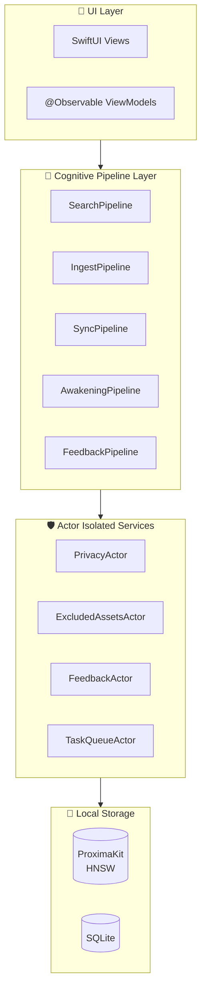

# Echo · 回响

**你的手机里藏着太多记忆——照片、视频、备忘录、语音……Echo 让这一切可以被「搜索」和「唤醒」。**

Echo 是一款**完全离线**的端侧 AI 记忆助手。它自动扫描你 iPhone 中的 **相册图片、视频、备忘录、语音备忘录**，通过 AI 理解内容后建立向量索引，让你能像谷歌搜索一样用自然语言检索自己的记忆——**所有数据永不离开设备**，所有 AI 推理在端侧完成，所有操作可追溯、可删除。

> 📖 **文档体系**：本项目采用 **规格驱动开发（Spec-Driven Development）** ，所有开发决策以 `docs/` 目录下的规格文档为唯一来源。Agent 协作基于 `AGENTS.md` 规约执行。

---

## 🖼️ Echo 能处理什么？

| 数据源 | 说明 | AI 能力 |
|--------|------|---------|
| 📷 **相册图片** | iPhone 照片库全部图片，自动扫描 | CLIP 视觉语义理解，支持「那只穿红裙子的猫」这类自然语言搜索 |
| 🎬 **相册视频** | 视频关键帧 + 音频轨道转写 | 帧级语义索引 + 语音内容全文检索 |
| 📝 **备忘录** | 系统备忘录 App 中所有笔记 | 文本向量化，支持中英文语义检索 |
| 🎙️ **语音备忘录** | 系统语音备忘录，自动转写为文本 | SenseVoice ASR 转写 + 文本向量索引 |

> ⚠️ **Echo 不会主动上传任何内容。** 所有数据在设备本地处理，AI 模型随 App 安装包分发，无需联网。

---

## 🎯 核心特性

| 特性             | 说明                                                      |
| ---------------- | --------------------------------------------------------- |
| **全离线**       | 所有数据端侧处理，永不离开设备                            |
| **隐私可审计**   | 隐私校验 (`PrivacyCheckpoint`) 全覆盖，审计日志保留 30 天 |
| **零网络依赖**   | 所有模型随 App 打包，无网络下载                           |
| **跨语言检索**   | CLIP 共享语义空间，中英双语互检 Recall@10 ≥ 85%           |
| **主动唤醒**     | 地理围栏 / 日期纪念日 / 情绪感知，三栖唤醒引擎            |
| **反馈学习**     | 纯本地反馈驱动重排（余弦阈值 ≥0.80，权重截断 ±0.5）       |
| **AI 创作**      | 情感内容生成、叙事报告、私有 Prompt 模板                  |
| **透明可控**     | 实时后台任务面板、统一错误矩阵、断点续传                  |

---

## 🏗️ 技术架构



**架构基准**：Cognitive Pipeline + Observable ViewModel + Actor Isolation（Swift 6）

| 组件       | 技术选型                                     |
| ---------- | -------------------------------------------- |
| 语言       | Swift 6 (`-strict-concurrency=complete`)     |
| UI 框架    | SwiftUI + `@Observable` (iOS 18 Observation) |
| 并发模型   | Swift Concurrency (Actor, Task, AsyncStream) |
| 向量数据库 | ProximaKit 1.7 (HNSW)                        |
| 关系数据库 | SQLite3 (系统内置)                          |
| 推理引擎   | Core ML (主力) + SenseVoice.cpp (ASR)      |

---

## 📁 项目结构

```
Echo/
├── App/                        # 应用入口
│   ├── EchoApp.swift
│   └── AppDelegate.swift (BGTask)
├── Core/
│   ├── Actors/                 # Actor 隔离服务
│   │   ├── PrivacyActor.swift
│   │   ├── ExcludedAssetsActor.swift
│   │   ├── FeedbackActor.swift
│   │   ├── ProgressActor.swift
│   │   ├── PendingOpsActor.swift
│   │   └── TaskQueueActor.swift
│   ├── Pipelines/              # Cognitive Pipeline
│   │   ├── SearchPipeline.swift
│   │   ├── IngestPipeline.swift
│   │   ├── SyncPipeline.swift
│   │   ├── AwakeningPipeline.swift
│   │   └── FeedbackPipeline.swift
│   ├── Models/
│   ├── Services/
│   └── Utils/
├── UI/
│   ├── ViewModels/
│   └── Views/
├── Resources/
│   ├── Models/ (MobileCLIP-B LT, multilingual-e5-small, SenseVoice Small)
│   └── StringCatalog/
├── EchoTests/                    # 🧪 单元测试与集成测试（按阶段分文件夹）
│   ├── Phase1/                   # Phase 1 测试
│   ├── Phase2/                   # Phase 2 测试
│   ├── Phase3/                   # Phase 3 测试
│   ├── Phase4/                   # Phase 4 测试
│   └── Phase5/                   # Phase 5 测试
├── docs/                       # 📚 项目文档中心
│   ├── ui/                     # Phase 3 UI 设计、架构、自动化、测试
│   │   ├── README.md           # UI 文档路由
│   │   ├── echo-memory-canvas-style.md
│   │   ├── automation-workflow.md
│   │   ├── architecture.md
│   │   ├── testing-and-artifacts.md
│   │   └── echo-readiness.md
│   └── ...
├── UIAutomation/               # UI 自动化合约、Fixtures、策略、Artifacts
│   ├── Contracts/
│   ├── Fixtures/
│   ├── Policies/
│   └── Artifacts/
├── .ui-automation/             # 单次 UI 运行状态
├── .opencode/commands/         # OpenCode 自定义命令
├── AGENTS.md                   # Agent 协作规约
└── README.md
```

---

## 📚 文档索引

| 文档                   | 路径                                                   | 用途                            |
| ---------------------- | ------------------------------------------------------ | ------------------------------- |
| **文档索引**           | `docs/INDEX.md`                                        | 文档导航地图（Agent 优先读取）  |
| **规格与需求**         | `docs/01-spec/用户故事与验收标准规格书.md`             | 66 个用户故事与 AC              |
| **架构设计**           | `docs/02-architecture/架构设计文档.md`                 | Cognitive Pipeline + Actor 架构 |
| **技术选型**           | `docs/02-architecture/技术选型文档.md`                 | 模型、数据库、推理框架选型      |
| **数据流**             | `docs/02-architecture/数据流全链路技术说明文档.md`     | 数据在各环节的流转细节          |
| **双语言实现**         | `docs/03-implementation/双语言实现说明文档.md`         | 跨语言检索、翻译、术语表        |
| **开发避坑手册**       | `docs/03-implementation/开发避坑与关键注意点手册.md`   | 禁止事项与防御性检查清单        |
| **AI Native 开发理念** | `docs/04-ai-native/AI Native开发理念与实战技巧手册.md` | AI Native 方法论与工具          |
| **产品创新工具**       | `docs/04-ai-native/产品创新工具全景指南.md`            | 前沿工具与融入方案              |
| **开发计划**           | `docs/05-planning/开发计划安排文档.md`                 | 里程碑、时间线、资源安排        |
| **任务状态**           | `docs/05-planning/task-status.json`                    | 任务执行状态追踪                |
| **延期任务**           | `docs/05-planning/deferred-items.json`                 | 延期到后续 Phase 的任务追踪      |
| **UI 文档路由**        | `docs/ui/README.md`                                    | Phase 3 UI 设计、架构、自动化、测试 |
| **Agent 规约**         | `AGENTS.md`                                            | OpenCode/Codex 协作规约         |

---

## 🚀 快速开始

### 前置要求

- macOS 15+ (Xcode 16+)
- iOS 18.0+ (部署目标)
- Swift 6 (开启 `-strict-concurrency=complete`)
- OpenCode 桌面版（推荐）或 Codex

### 克隆与初始化

```bash
git clone https://github.com/your-username/Echo.git
cd Echo
```

### OpenCode 工作流

1. **启动 OpenCode 桌面版**，打开项目目录
2. **运行初始化命令**：`init-session-echo`
   - 自动加载 AGENTS.md 和 INDEX.md
   - 定位当前任务并锁定 AC
3. **开始开发**：`next-task-echo`
   - 自动执行 TDD 流程：写测试 → 实现 → 运行测试 → 创建 PR

### 核心自定义命令

| 命令                    | 用途                  |
| ----------------------- | --------------------- |
| `init-session-echo`     | 新会话初始化          |
| `status-echo`           | 查看项目状态          |
| `next-task-echo`        | 执行下一个 ready 任务 |
| `do-task-echo {id}`     | 执行指定任务          |
| `retry-task-echo`       | 重试被阻断的任务      |
| `read-spec-echo`        | 快速阅读任务规格      |
| `test-unit-echo`        | 运行当前任务单元测试  |
| `test-phase-echo`       | 执行阶段集成测试任务（分支→PR） |
| `test-integration-echo` | 运行全量集成测试      |
| `commit-pr-echo`        | 提交代码并创建 PR     |
| `pr-review-echo`        | AI 预审 PR            |
| `explain-echo`          | 解释代码/架构逻辑     |
| `sync-docs-echo`        | 同步更新文档          |
| `ui-bootstrap-build-echo` | Phase 3 UI 实现入口   |
| `ui-status-echo`        | Phase 3 UI 状态查询   |
| `ui-retry-echo`         | Phase 3 UI 失败重试   |

---

## 🤖 Agent 协作规约

本项目使用 `AGENTS.md` 作为 Agent（OpenCode/Codex/Cursor/Claude）协作的 **唯一权威规约**。

**核心原则**：**无引用，不编码。**

Agent 在执行任何任务前，必须：
1. 查阅 `AGENTS.md` §0.2 任务映射表
2. 读取相关规格文档章节
3. 逐字粘贴相关 AC/规则原文
4. 等待人类确认后才开始编码

**绝对红线**（违反即阻断）：
- R-001：禁止任何数据上传云端
- R-002：禁止用户主动输入文本记忆
- R-003：原始文件级联删除不写入 ExcludedAssets
- R-004：AI 输出语言仅限 zh-Hans/en-US
- R-005：模型加载无网络下载
- R-006：所有异步操作必须包含 PrivacyCheckpoint
- R-007：禁止使用 Combine / @unchecked Sendable / nonisolated(unsafe)
- R-008：所有跨 Actor 调用必须 await

---

## 🧪 测试

```bash
# 单元测试（通过自定义命令执行，自动走分支→PR流程）
do-task-echo {任务ID}

# 阶段集成测试（每个 Phase 的最后一个正式任务，走分支→PR流程）
test-phase-echo [{阶段ID}]

# 全量集成测试（串行执行，避免数据库竞争）
xcodebuild test -project Echo.xcodeproj -scheme Echo \
  -destination 'platform=iOS Simulator,name=iPhone 17 Pro' \
  -parallel-testing-enabled NO
```

**质量门禁**：
- 单元测试覆盖率 ≥ 95%
- 跨语言 Recall@10 ≥ 85%
- 检索 P95 延迟 < 200ms
- 内存峰值 < 1.5GB
- PrivacyCheckpoint 覆盖率 100%

---

## 📝 开发计划

| 阶段       | 时间                | 内容           |
| ---------- | ------------------- | -------------- |
| **阶段 1** | 6月15日 - 7月12日   | 基础设施搭建   |
| **阶段 2** | 7月13日 - 9月20日   | 核心认知管线   |
| **阶段 3** | 7月26日 - 10月18日  | UI 与集成（13 个任务，44 个故事） |
| **阶段 4** | 11月16日 - 12月15日 | 质量保障与发布 |
| **阶段 5** | 并行                | 创新工具预研   |

详见 `docs/05-planning/开发计划安排文档.md`

---

## 🤝 贡献指南

1. 阅读 `AGENTS.md` 和 `docs/INDEX.md`
2. 遵循 **规格驱动开发** 流程
3. 所有代码必须通过 TDD 流程
4. PR 必须包含 AC 覆盖对照表
5. 核心文件必须包含“出生证明”水印
6. 提交遵循 Git 规范（§3.1-3.3）

---

## 📄 许可证

[待定]

---

## 🔗 相关资源

- [OpenCode 桌面版](https://opencode.ai)
- [Swift 6 并发](https://docs.swift.org/swift-book/documentation/the-swift-programming-language/concurrency/)
- [ProximaKit](https://github.com/vivekptnk/ProximaKit)
- [Core ML](https://developer.apple.com/documentation/coreml)

---

**文档维护声明**

本 README 与 Echo v4.6 全量规格书、AGENTS.md v5.18 及所有 docs/ 文档协同维护。任何重大变更需同步更新本文档。

**下次全面复审日期**：2026-08-15（与 Phase 3 UI 阶段同步）