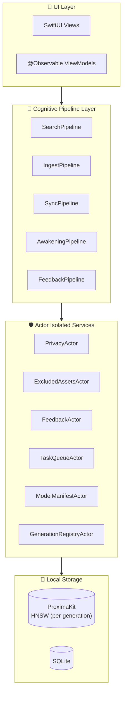

# Echo · 回响

**你的手机里藏着太多记忆——照片、视频、备忘录、语音……Echo 让这一切可以被「搜索」和「唤醒」。**

Echo 是一款**完全离线**的端侧 AI 记忆助手。它自动索引你的 **相册图片与视频**，并通过 **Share Sheet 显式分享**摄入备忘录与语音备忘录，通过 AI 理解内容后建立向量索引，让你能像谷歌搜索一样用自然语言检索自己的记忆——**所有数据永不离开设备**，所有 AI 推理在端侧完成，所有操作可追溯、可删除。

> 📌 **数据源接入方式（R-5.2 决策 2026-08-01）**：受 iOS 公开 API 限制，Echo 无法自动/后台读取系统备忘录、语音备忘录或 iMessage。已批准路径：**Photos 授权范围内读取（PhotoKit）+ Share Extension 用户主动分享**。备忘录/语音备忘录需用户通过分享按钮显式摄入。

> 📖 **文档体系**：本项目采用 **规格驱动开发（Spec-Driven Development）** ，所有开发决策以 `docs/` 目录下的规格文档为唯一来源。Agent 协作基于 `AGENTS.md` 规约执行。

---

## 🖼️ Echo 能处理什么？

> **实现状态图例**：✅ 已实现且有测试证据 · 🔶 骨架/Stub（接口就绪，推理待接入）· 🔮 计划中

| 数据源 | 接入方式 | AI 能力 | 状态 |
|--------|---------|---------|:---:|
| 📷 **相册图片** | PhotoKit 授权范围内读取（自动） | SigLIP2 视觉语义理解，支持「那只穿红裙子的猫」这类自然语言搜索 | 🔶 |
| 🎬 **相册视频** | PhotoKit 授权范围内读取（自动） | 帧级语义索引 + 语音内容全文检索 | 🔶 |
| 📝 **备忘录** | Share Sheet 显式分享（需用户操作） | E5 文本向量化，支持中英文语义检索 | 🔶 |
| 🎙️ **语音备忘录** | Share Sheet 显式分享（需用户操作） | Whisper ASR 真实转写（whisper.cpp v1.9.2，3F.3b）+ 文本向量索引 | 🔶 |

> ⚠️ **Echo 不会主动上传任何内容。** 所有数据在设备本地处理。
> 📌 **目标态**：AI 模型随 App 安装包分发、运行时无网络请求（R-005 红线）。**3F.3 已交付（2026-08-06）**：E5 真实 384d 文本推理（Unigram tokenizer + Core ML）、SigLIP2 视觉预处理与转换源工件、Whisper tiny GGUF 工件与 fail-closed 桥接、LanguageAligner（R-004 单次重试）、模型溯源登记（model-provenance-register）。SigLIP2 Core ML 转换仍追踪于 3F.3 后续任务与 model-provenance-register §3。**3F.3b 已交付（2026-08-09）**：whisper.cpp v1.9.2 运行时接入（vendored SPM 本地包 + GGML_CPU_GENERIC 构建），`WhisperASREngine` 真实转写经 `WhisperRuntimeBridge` → `NativeWhisperCInterop`，GGUF SHA-256 校验（818710568da3ca15689e31a743197b520007872ff9576237bda97bd1b469c3d7）+ `reportModelLoaded(.whisperTiny)` 上报。
>
> 📌 **当前状态**：核心架构（Actor 隔离、认知管线、隐私校验、反馈学习）已实现并通过测试；AI 推理层（3F.3）已接入 E5 真实推理 + SigLIP2 工件与 fail-closed 桥接，Whisper 真实转写由 3F.3b 接入（whisper.cpp v1.9.2）。数据源接入遵循 R-5.2 决策（Photos 自动 + 备忘录/语音备忘录 Share 分享）。
>
> 📌 **3F.2 已交付（2026-08-05）**：真实来源边界——`PhotoKitSourceAdapter`（授权状态机 + 撤回即停 + 本地仅下载策略 + `.dataSourceConnected` 审计）、`PhotoKitChangeObserver`（变更去重）、`EchoShareExtension` target（Share 预览确认 → App Group 信封原子入队）、`SharedImportQueueActor`（去重 + 恰好一次消费，App 重启恢复）、`IngestPipeline.ingestShared`/`drainSharedImports`（R-006 + ExcludedAssets fail-closed + hash-only `.shareExtensionImported` 审计）。App/Extension 共享 `group.com.echo.Echo` App Group。真实模型工件推理（E5/SigLIP2/Whisper）由 3F.3 接入；真实来源 E2E 证据于 3F.11 no-fixture 门禁验证。
>
> 📌 **3F.6 已交付（2026-08-11）**：生产检索与反馈闭环——多通道 generation 路由检索（text_dense/vision_dense/ocr_text/lexical 经 `ActiveRouteSet`）+ RRF 融合 + ID-keyed 元数据回填、通道超时 → `timedOut` 部分结果（US-RET-008）、policy-aware 结果缓存（US-RET-007）、追问查询 FIFO ≤10 + memoryIds 隐式过滤 + `.followUpQuery` 审计（US-RET-005，AC-3 LLM 改写延后 DEF-58-001）、query-conditioned 反馈重排 + 反馈 generation 身份（ADR-010）、L2 反馈失败 → `PendingOperations`、跨 App 意图解析与时间对齐融合 + 逐源授权 + `.crossAppSearch` 审计（US-SRC-010）、主观有界重排（US-SRC-011）、`searchCanonical` ORDER BY rank（DEF-56-006）。SigLIP2 视觉推理仍依赖 3F.3a Core ML 转换审批，视觉/OCR 通道空索引降级为 timedOut 部分结果（不阻断其他通道）。

---

## 🎯 核心特性

| 特性             | 说明                                                      | 状态 |
| ---------------- | --------------------------------------------------------- | :---: |
| **全离线**       | 所有数据端侧处理，永不离开设备                            | ✅ |
| **隐私可审计**   | 隐私校验 (`PrivacyCheckpoint`) 全覆盖，审计日志保留 30 天 | ✅ |
| **零网络依赖**   | 所有模型随 App 打包，无网络下载                           | ✅ |
| **反馈学习**     | 纯本地反馈驱动重排（余弦阈值 ≥0.80，权重截断 ±0.5）       | ✅ |
| **跨语言检索**   | E5 语义空间 + 生产多通道 RRF 融合（3F.6：text_dense/lexical 通道就绪；SigLIP2 视觉/OCR 通道空索引降级 timedOut 部分结果），中英双语互检（Recall@10 ≥ 85% 目标） | 🔶 |
| **主动唤醒**     | 地理围栏 / 日期纪念日 / 情绪感知，三栖唤醒引擎            | 🔶 |
| **透明可控**     | 实时后台任务面板、统一错误矩阵、断点续传                  | 🔶 |
| **AI 创作**      | 情感内容生成、叙事报告、私有 Prompt 模板                  | 🔮 |

---

## 🏗️ 技术架构



**架构基准**：Cognitive Pipeline + Observable ViewModel + Actor Isolation（Swift 6）

| 组件       | 技术选型                                     |
| ---------- | -------------------------------------------- |
| 语言       | Swift 6 (`-strict-concurrency=complete`)     |
| UI 框架    | SwiftUI + `@Observable` (iOS 18 Observation) |
| 并发模型   | Swift Concurrency (Actor, Task, AsyncStream) |
| 向量数据库 | ProximaKit 1.7 (HNSW)                        |
| 关系数据库 | SQLite3 (系统内置)                          |
| 推理引擎   | Core ML (主力) + whisper.cpp (ASR)         |

---

## 📁 项目结构

```
Echo/
├── App/                        # 应用入口
│   ├── EchoApp.swift
│   └── AppDelegate.swift (BGTask)
├── Core/
│   ├── Actors/                 # Actor 隔离服务
│   │   ├── PrivacyActor.swift
│   │   ├── ExcludedAssetsActor.swift
│   │   ├── FeedbackActor.swift
│   │   ├── ProgressActor.swift
│   │   ├── PendingOpsActor.swift
│   │   ├── TaskQueueActor.swift
│   │   ├── ModelManifestActor.swift
│   │   └── GenerationRegistryActor.swift
│   ├── Pipelines/              # Cognitive Pipeline
│   │   ├── SearchPipeline.swift
│   │   ├── IngestPipeline.swift
│   │   ├── SyncPipeline.swift
│   │   ├── AwakeningPipeline.swift
│   │   └── FeedbackPipeline.swift
│   ├── Models/
│   ├── Services/
│   └── Utils/
├── UI/
│   ├── AppShell/                # App 壳：TabView + NavigationStack + DI
│   ├── Home/                    # 主视图（唤醒卡片 + 离线指示）
│   ├── Search/                  # 检索（结果 + 反馈 + 低置信度）
│   ├── Detail/                  # 记忆详情（编辑 + 翻译 + 冲突解决）
│   ├── Settings/                # 设置页
│   ├── Onboarding/              # 引导流程（PIPL + 权限 + 语言 + 模型加载）
│   ├── Awakening/               # 唤醒投递（通知 + 权限 + 地理围栏设置）
│   ├── BackgroundTask/          # 实时后台任务面板
│   ├── Creation/                # AI 创作（生成/保存/导出）
│   ├── Degradation/             # 降级横幅（L1~L4 错误 + 低电量/过热）
│   ├── ResumeProgress/          # 断点续传提示（US-SYS-001）
│   └── Translation/             # 跨语言翻译展示层
├── Resources/
│   ├── Models/ (SigLIP2 checkpoint 转换源, multilingual-e5-small, Whisper GGUF)
│   └── StringCatalog/
├── EchoTests/                    # 🧪 单元测试与集成测试（按阶段分文件夹）
│   ├── Phase1/                   # Phase 1 测试
│   ├── Phase2/                   # Phase 2 测试
│   ├── Phase3/                   # Phase 3 测试
│   ├── Phase4/                   # Phase 4 测试
│   └── Phase5/                   # Phase 5 测试
├── docs/                       # 📚 项目文档中心
│   ├── ui/                     # Phase 3 UI 设计、架构、自动化、测试
│   │   ├── README.md           # UI 文档路由
│   │   ├── echo-memory-canvas-style.md
│   │   ├── automation-workflow.md
│   │   ├── architecture.md
│   │   ├── testing-and-artifacts.md
│   │   └── echo-readiness.md
│   └── ...
├── UIAutomation/               # UI 自动化合约、Fixtures、策略、Artifacts
│   ├── Contracts/
│   ├── Fixtures/
│   ├── Policies/
│   └── Artifacts/
├── .ui-automation/             # 单次 UI 运行状态
├── .opencode/commands/         # OpenCode 自定义命令
├── AGENTS.md                   # Agent 协作规约
└── README.md
```

---

## 📚 文档索引

| 文档                   | 路径                                                   | 用途                            |
| ---------------------- | ------------------------------------------------------ | ------------------------------- |
| **文档索引**           | `docs/INDEX.md`                                        | 文档导航地图（Agent 优先读取）  |
| **规格与需求**         | `docs/01-spec/用户故事与验收标准规格书.md`             | 66 个用户故事与 AC              |
| **架构设计**           | `docs/02-architecture/架构设计文档.md`                 | Cognitive Pipeline + Actor 架构 |
| **技术选型**           | `docs/02-architecture/技术选型文档.md`                 | 模型、数据库、推理框架选型      |
| **数据流**             | `docs/02-architecture/数据流全链路技术说明文档.md`     | 数据在各环节的流转细节          |
| **双语言实现**         | `docs/03-implementation/双语言实现说明文档.md`         | 跨语言检索、翻译、术语表        |
| **开发避坑手册**       | `docs/03-implementation/开发避坑与关键注意点手册.md`   | 禁止事项与防御性检查清单        |
| **AI Native 开发理念** | `docs/04-ai-native/AI Native开发理念与实战技巧手册.md` | AI Native 方法论与工具          |
| **产品创新工具**       | `docs/04-ai-native/产品创新工具全景指南.md`            | 前沿工具与融入方案              |
| **开发计划**           | `docs/05-planning/开发计划安排文档.md`                 | 里程碑、时间线、资源安排        |
| **任务状态**           | `docs/05-planning/task-status.json`                    | 任务执行状态追踪                |
| **延期任务**           | `docs/05-planning/deferred-items.json`                 | 延期到后续 Phase 的任务追踪      |
| **UI 文档路由**        | `docs/ui/README.md`                                    | Phase 3 UI 设计、架构、自动化、测试 |
| **Agent 规约**         | `AGENTS.md`                                            | OpenCode/Codex 协作规约         |

---

## 🚀 快速开始

### 前置要求

- macOS 15+ (Xcode 16+)
- iOS 18.0+ (部署目标)
- Swift 6 (开启 `-strict-concurrency=complete`)
- OpenCode 桌面版（推荐）或 Codex

### 克隆与初始化

```bash
git clone https://github.com/your-username/Echo.git
cd Echo
```

### OpenCode 工作流

1. **启动 OpenCode 桌面版**，打开项目目录
2. **运行初始化命令**：`init-session-echo`
   - 自动加载 AGENTS.md 和 INDEX.md
   - 定位当前任务并锁定 AC
3. **开始开发**：`next-task-echo`
   - 自动执行 TDD 流程：写测试 → 实现 → 运行测试 → 创建 PR

### 核心自定义命令

| 命令                    | 用途                  |
| ----------------------- | --------------------- |
| `init-session-echo`     | 新会话初始化          |
| `status-echo`           | 查看项目状态          |
| `next-task-echo`        | 执行下一个 ready 任务 |
| `do-task-echo {id}`     | 执行指定任务          |
| `retry-task-echo`       | 重试被阻断的任务      |
| `read-spec-echo`        | 快速阅读任务规格      |
| `test-unit-echo`        | 运行当前任务单元测试  |
| `test-phase-echo`       | 执行阶段集成测试任务（分支→PR） |
| `test-integration-echo` | 运行全量集成测试      |
| `commit-pr-echo`        | 提交代码并创建 PR     |
| `pr-review-echo`        | AI 预审 PR            |
| `explain-echo`          | 解释代码/架构逻辑     |
| `sync-docs-echo`        | 同步更新文档          |
| `ui-bootstrap-build-echo` | Phase 3 UI 实现入口   |
| `ui-status-echo`        | Phase 3 UI 状态查询   |
| `ui-retry-echo`         | Phase 3 UI 失败重试   |

---

## 🤖 Agent 协作规约

本项目使用 `AGENTS.md` 作为 Agent（OpenCode/Codex/Cursor/Claude）协作的 **唯一权威规约**。

**核心原则**：**无引用，不编码。**

Agent 在执行任何任务前，必须：
1. 查阅 `AGENTS.md` §0.2 任务映射表
2. 读取相关规格文档章节
3. 逐字粘贴相关 AC/规则原文
4. 等待人类确认后才开始编码

**绝对红线**（违反即阻断）：
- R-001：禁止任何数据上传云端
- R-002：禁止用户主动输入文本记忆
- R-003：原始文件级联删除不写入 ExcludedAssets
- R-004：AI 输出语言仅限 zh-Hans/en-US
- R-005：模型加载无网络下载
- R-006：所有异步操作必须包含 PrivacyCheckpoint
- R-007：禁止使用 Combine / @unchecked Sendable / nonisolated(unsafe)
- R-008：所有跨 Actor 调用必须 await

---

## 🧪 测试

```bash
# 单元测试（通过自定义命令执行，自动走分支→PR流程）
do-task-echo {任务ID}

# 阶段集成测试（每个 Phase 的最后一个正式任务，走分支→PR流程）
test-phase-echo [{阶段ID}]

# 全量集成测试（串行执行，避免数据库竞争）
xcodebuild test -project Echo.xcodeproj -scheme Echo \
  -destination 'platform=iOS Simulator,name=iPhone 17 Pro' \
  -parallel-testing-enabled NO
```

**质量门禁**：
- 单元测试覆盖率 ≥ 95%
- 跨语言 Recall@10 ≥ 85%
- 检索 P95 延迟 < 200ms
- 内存峰值 < 1.5GB
- PrivacyCheckpoint 覆盖率 100%

---

## 📝 开发计划

| 阶段       | 时间                | 内容           |
| ---------- | ------------------- | -------------- |
| **阶段 1** | 6月15日 - 7月12日   | 基础设施搭建   |
| **阶段 2** | 7月13日 - 9月20日   | 核心认知管线   |
| **阶段 3** | 7月26日 - 10月18日  | UI 与集成（13 个任务，44 个故事）— UI 与可注入交互切片完成，不代表生产功能完成 |
| **阶段 3F** | 2026-08 启动        | 功能完成与生产集成（14 个任务 3F.0..3F.11 + 3F.3a/3F.3b，Phase 4 唯一入口 3F.11） |
| **阶段 4** | 11月16日 - 12月15日 | 质量保障与发布（锁定在 3F.11 之后，未开始） |
| **阶段 5** | 并行                | 创新工具预研   |

详见 `docs/05-planning/开发计划安排文档.md`

---

## 🚩 当前阶段：Phase 3F — 功能完成与生产集成

> **ledger 状态**：`current_phase` 为字符串 `"3F"`，`phase_order = ["1","2","3","3F","4","5"]`。Phase 3 已 `done`（"UI 与可注入交互切片完成，不代表生产功能完成"）；Phase 4 通过 `entry_gate: "3F.11"` 锁定，**尚未开始**。

**目标**：在默认 Echo App 路径上完成生产功能闭环（同意、真实来源、真实模型、规范存储、摄入、检索、反馈、编辑/删除、唤醒、翻译/创作、重启恢复），以 **3F.11 的无 fixture 生产 E2E 门禁** 作为 Phase 4 的唯一入口。

> **3F.1 已交付（2026-08-04）**：生产 composition root（`Echo/App/AppComposition.swift`）+ deny-by-default 同意（`ConsentStoreActor`，版本与时间戳持久化）+ 事务性撤回/清除（`PurgeBoundary`，失败进 blocked 并写审计）+ 审计存储契约（必填字段 / hash-only `contentHash` / 30 天清理 / NSFileProtectionComplete）+ 显式启动状态（`requiresConsent` / `ready` / `modelUnavailable` / `routeUnavailable` / `indexUnavailable` / `purgeBlocked`）。无 CloudKit。

**14 个任务（3F.0..3F.11 + 3F.3a/3F.3b）**：
- **3F.0** 规格、范围、账本与接口冻结（docs-only bootstrap）
- **3F.1** Production composition、首次启动、同意与隐私
- **3F.2** PhotoKit、Share Extension 与真实来源
- **3F.3** E5、SigLIP2、Whisper 与离线生成决策落地（E5 真实推理；SigLIP2/Whisper 工件 + fail-closed 桥接）
- **3F.3a** SigLIP2 Core ML 转换与视觉推理接入（2026-08-07 拆分自 3F.3）
- **3F.3b** whisper.cpp 运行时接入与真实转写（2026-08-07 拆分自 3F.3）
- **3F.4** Canonical storage 与 generation 生命周期（✅ 2026-08-09：`CanonicalMemoryRepositoryActor` 确定性 ID + 事务 CRUD + 全删除边界；`GenerationRegistryActor` shadow build / 原子发布 / 回滚 / 重启恢复 / 持久化；反馈 generation 身份；US-AWK-007 编辑字段持久化）
- **3F.5** Production ingestion（✅ 2026-08-10：生产摄入路径——`ingestProductionPhoto/Video/SharedText/SharedAudio` 经 `CanonicalMemoryRepositoryActor` 单事务写入 canonical + 每代向量 + FTS，向量路由由 `GenerationRegistryActor` 活跃路由解析（ADR-010）；`TaskQueueActor` 串行入队 + `ProgressActor` 断点续传（ADR-011）；`SyncPipeline` 生产删除路由；AppDelegate 装配真实 E5/SigLIP2/Whisper，无 Stub）
- **3F.5** Production ingestion
- **3F.6** Production search 与 feedback（✅ 2026-08-11：生产多通道检索——`SearchChannelAdapters` 按 `ActiveRouteSet` 逐通道解析每代向量存储（text_dense E5 384d / vision_dense SigLIP2 768d / ocr_text / lexical），RRF 融合 + ID-keyed `metadataByID` 回填（DEF-34-001），通道超时 → `timedOut` 部分结果、L3 路由缺失以 error 区分（US-RET-008 / DEF-34-002）；`SearchResultCacheActor` policy-aware TTL 缓存（US-RET-007）；追问查询 FIFO 历史 ≤10 轮 + memoryIds 隐式过滤 + `.followUpQuery` 审计（US-RET-005 AC-1/2/4/5，AC-3 LLM 改写延后 DEF-58-001）；`FeedbackActor` 按 queryText 条件化重排（US-FBK-001 AC-4）+ `FeedbackPipeline` 传递活跃 generationId（ADR-010），L2 反馈失败 → `PendingOperations`（DEF-37-001）；`CrossAppIntentParser` + `CrossAppFusionEngine` 跨 App 意图解析与时间对齐融合、逐源授权 + `.crossAppSearch` 审计（US-SRC-010，live HealthKit provider 属 3F.8）；`BoundedReranker` 主观有界重排（US-SRC-011）；`searchCanonical` ORDER BY rank（DEF-56-006））
- **3F.6** Production search 与 feedback
- **3F.7** UI 到 Core 全域接线
- **3F.8** Awakening 与 system adapters（✅ 2026-08-11：生产唤醒系统适配器——ADR-012 全决策落地。`CoreLocationProvider`（CLLocationManager 地理围栏 enter/exit + 权限感知，US-AWK-001）、`HealthKitSystemProvider`（符合 `CrossAppSourceProvider` sourceType="health" → 3F.6 US-SRC-010 fusion，仅返回授权范围内最小化时序样本，denied 来源不查询，ADR-012 决策-4）、`LocalNotificationAdapter`（通知请求/调度，内容最小化，请求与响应路由分离）+ `NotificationResponseRouter`（点击→详情路由，US-AWK-005）、`AwakeningCardRepositoryActor`（SQLite 卡片持久化 + cardId 重启去重，决策-5）；`AwakeningPipeline` 增补 best-effort 纪念日日期窗口（US-AWK-002）+ `.dateAwakening` 审计；`AwakeningSettingsViewModel` 读取真实系统权限状态；`HomeViewModel` 加载持久化卡片；AppDelegate 装配全部适配器）
- **3F.9** Apple Translation 与 grounded creation（✅ 2026-08-11：`AppleTranslationService` 展示层翻译——LanguageAvailability 检查（不支持语言对 → 保留原文 + 语言标签）+ 术语表优先（US-SYN-007 AC-3）+ NLTagger 源语言置信度绝不编造（ADR-005）；`PersistentTranslationCache` TTL=7d 文件持久化跨重启（ADR-013 决策 2）；`TerminologyTable` 领域术语表（Core/Services）；`CreativePipeline` grounded 生成 + 溯源锚点 + `.synthesis`/`.creativeGeneration`/`.synthesisFallback` 审计 + R-004 语言对齐（fail-closed 无 LLM 运行时）；`CreationExportService` Markdown/PDF/系统 share 导出，无 `notes://` 深链（ADR-013 决策 4）。MemoryDetailViewModel 生产默认 AppleTranslationService + PersistentTranslationCache；CreationViewModel 生产路径 grounded 生成 + saveToNotes 系统 share 流。DEF-43-002/003 closed，DEF-44-001 partial（i18n 留 3F.10））
- **3F.10** i18n、accessibility 与 production errors（✅ 2026-08-12：统一语言中心 `LanguageCenter`（US-DIS-001/SET-001——单一 App 语言设置同时驱动 UI 与 AI preferredLanguage、跟随系统、立即生效、`.languageUnified` 审计）；`Localizable.xcstrings` 双语目录 336 keys 100% parity，全 UI 表面 + 通知文案 + 错误提示 + AX 标签迁入；L1~L4 错误分级映射与本地化用户文案（`ErrorClassifier`/`ErrorSeverity`）；`SystemMonitor` 低电量/热降级生产运行时接线（US-RES-002/003 横幅 + `.degradationWarning` 审计 + 低电量自动暂停后台任务 + 手动模型重试）；VoiceOver announcement 与双设备 Live Sim Review；`.backgroundTaskUIAccessed`/`.backgroundTaskInterrupted` 审计；`.migration` PrivacyOperation + exportPackage PrivacyCheckpoint（DEF-59-004）。关闭 DEF-41-1/41-2/42-002/43-001/44-001/45-001/46-001/52-001/60-001/39-1/59-004）
- **3F.11** Production E2E 与 Phase 4 准入门禁（阶段集成测试）

**Phase 3F 规划文档**：
- `docs/05-planning/phase3f-execution-plan.md` — Phase 3F 开发 Agent 执行指令与任务账本迁移契约
- `docs/05-planning/phase3f-story-matrix.md` — 66 个用户故事的 Phase 3F 归属矩阵
- `docs/05-planning/phase3f-evidence-index.md` — Phase 3F 预合并证据索引

**决策记录（ADR-006..ADR-014）**：`docs/decisions/ADR-006`~`ADR-014` 覆盖 Phase 3F 范围契约、生产 composition 与同意、来源导入边界、离线模型运行时、canonical generation 生命周期、任务进度边界、唤醒系统边界、创作导出边界与发布合规边界。

**Phase 4/5 任务重排**：`4.20 → 3F.2`；`4.21/4.22 → 3F.3`；`4.12/4.13/4.23/4.24/4.25 → 5.6..5.10`；`5.5 → 5.11`。

---

## 🤝 贡献指南

1. 阅读 `AGENTS.md` 和 `docs/INDEX.md`
2. 遵循 **规格驱动开发** 流程
3. 所有代码必须通过 TDD 流程
4. PR 必须包含 AC 覆盖对照表
5. 核心文件必须包含“出生证明”水印
6. 提交遵循 Git 规范（§3.1-3.3）

---

## 📄 许可证

[待定]

---

## 🔗 相关资源

- [OpenCode 桌面版](https://opencode.ai)
- [Swift 6 并发](https://docs.swift.org/swift-book/documentation/the-swift-programming-language/concurrency/)
- [ProximaKit](https://github.com/vivekptnk/ProximaKit)
- [Core ML](https://developer.apple.com/documentation/coreml)

---

**文档维护声明**

This README is co-maintained with Echo v4.6 full spec, AGENTS.md v5.20, and all docs/ documents. Any major changes must update this document accordingly.

**下次全面复审日期**：2026-08-15（与 Phase 3 UI 阶段同步）