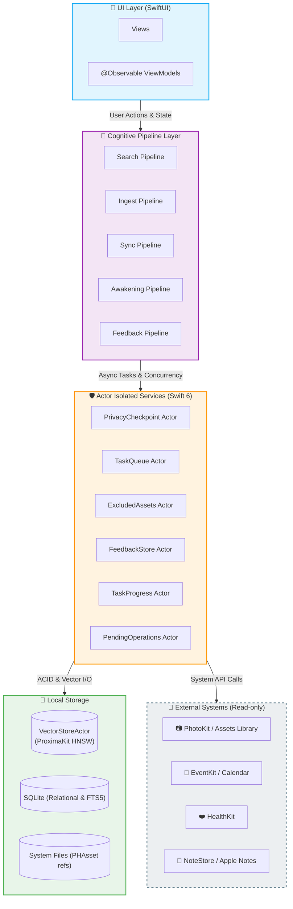
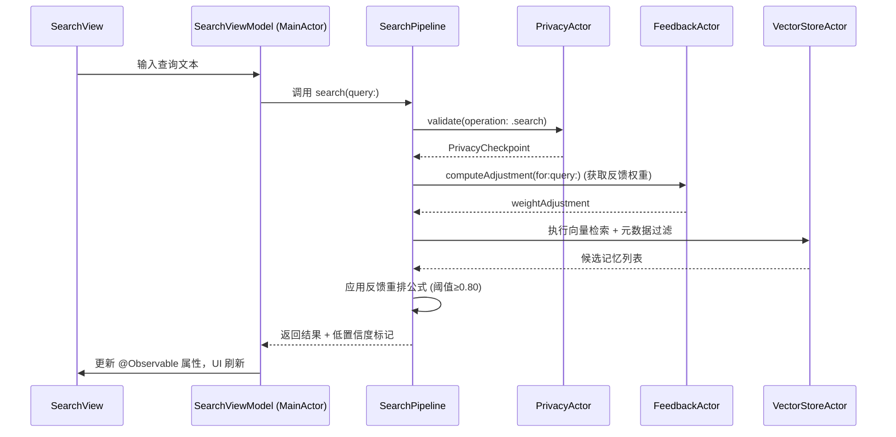
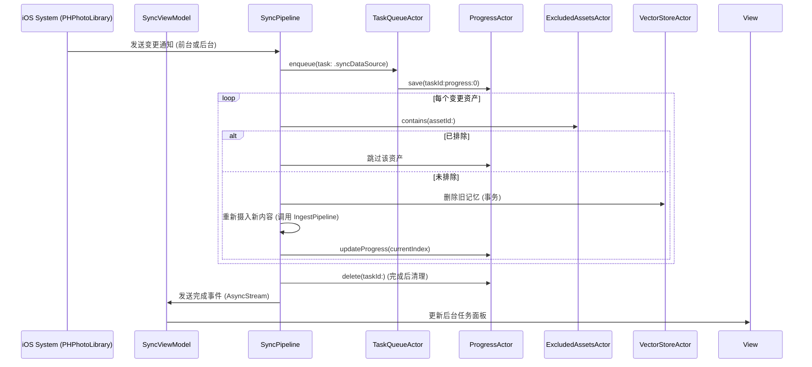
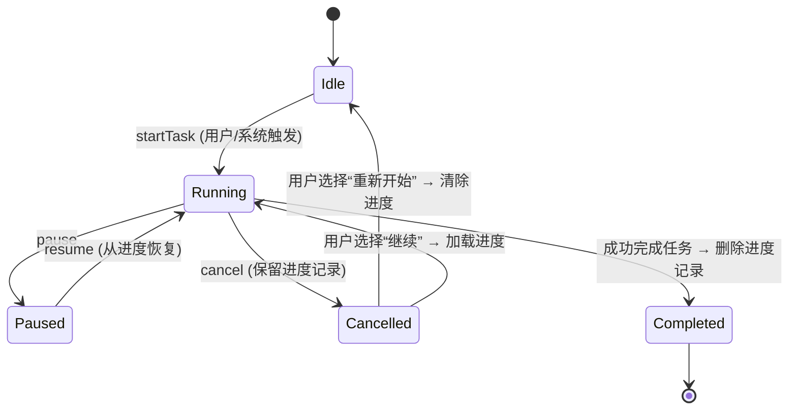
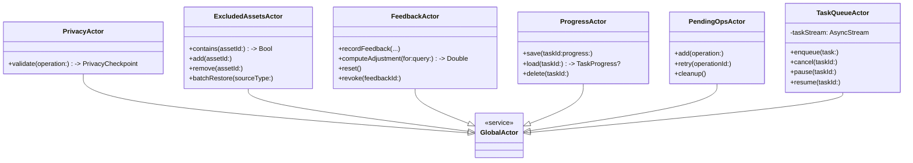
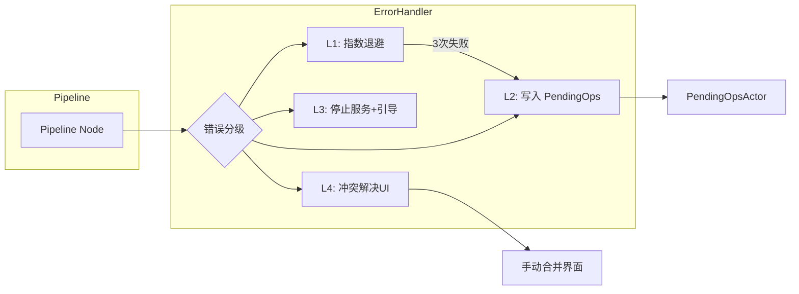
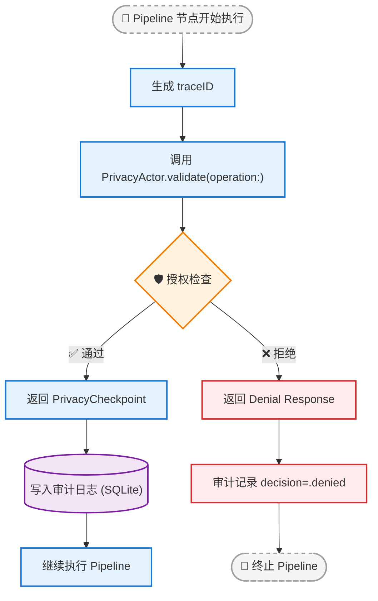

# Echo · 回响：Cognitive Pipeline + Observable ViewModel + Actor Isolation 架构设计文档

**版本**：v1.3

**生效日期**：2026-09-02

**适用规格**：Echo v4.6 全量用户故事与验收标准规格书

**技术基准**：iOS 18+，Swift 6, Swift Concurrency, Observation Framework

------

## 1. 架构总览

Echo 采用 **Cognitive Pipeline** 模式组织所有认知处理流程（检索、摄入、同步、唤醒、反馈学习），每个 Pipeline 节点封装在独立 `Actor` 中以保证线程安全。UI 层使用 `@Observable` 视图模型（ViewModel）监听 Pipeline 的进度流并驱动 SwiftUI 刷新。整体架构遵循 **本地优先、隐私可审计、任务可中断/续传** 的核心原则。

### 1.1 架构分层图



### 1.2 核心设计原则

| 原则                 | 描述                                                         | 实现方式                                                     |
| -------------------- | ------------------------------------------------------------ | ------------------------------------------------------------ |
| **Actor 隔离**       | 所有可变共享状态（数据库、任务队列、排除表等）必须封装在 Actor 中 | 使用 `actor` 关键字，禁止外部直接访问                        |
| **Pipeline 无状态**  | Pipeline 节点本身不持有可变状态，仅协调 Actor 调用           | 每个 Pipeline 节点是 `struct`、`class` 或 `actor`（仅当仅持有不可变 actor 引用、无 `var` 状态时），内部调用 Actor 方法 |
| **隐私校验强制执行** | 每个 Pipeline 入口必须调用 `PrivacyCheckpoint.validate()`    | 编译器/CI 强制，无校验则编译失败                             |
| **统一错误矩阵**     | 所有异步操作按 L1~L4 分级，L2 持久化到 `PendingOperations` 表 | 通过 `ErrorHandler` 协议统一处理                             |
| **断点续传**         | 长任务支持暂停/取消并保留进度                                | 进度存入 SQLite `TaskProgress` 表，由 `ProgressActor` 管理   |
| **反应式 UI**        | ViewModel 通过 `AsyncStream` 订阅 Pipeline 进度/结果         | 使用 `@Observable` 和 `@MainActor` 确保 UI 线程安全          |

------

## 2. 模块划分与职责

### 2.1 Cognitive Pipeline 节点

每个 Pipeline 对应一个认知处理流，由一系列步骤组成，步骤间通过 `AsyncSequence` 串联。

| Pipeline              | 职责                                               | 主要 Actor 依赖                                        | 对应规格故事   |
| --------------------- | -------------------------------------------------- | ------------------------------------------------------ | -------------- |
| **SearchPipeline**    | 处理用户查询，执行向量检索 + 元数据过滤 + 反馈重排 | `PrivacyActor`, `FeedbackActor`, `VectorStoreActor`    | US-RET-001~008 |
| **IngestPipeline**    | 摄入新记忆（文本/图片/视频/语音）并向量化          | `PrivacyActor`, `ExcludedAssetsActor`, `VectorStoreActor` | US-ING-001~006 |
| **IngestPipeline（3F.5 生产摄入）** | 经 `CanonicalMemoryRepositoryActor.commit` 单事务写入 canonical + 每代向量 + FTS；向量路由由 `GenerationRegistryActor` 活跃路由解析（ADR-010） | `PrivacyActor`, `ExcludedAssetsActor`, `CanonicalMemoryRepositoryActor`, `GenerationRegistryActor`, `TaskQueueActor`, `ProgressActor` | US-ING-001~006, US-SRC-012/013, US-SYS-001 |
| **SearchPipeline（3F.6 生产检索）** | 多通道 generation 路由检索——`SearchChannelAdapters` 逐通道（text_dense E5 384d / vision_dense SigLIP2 768d / ocr_text / lexical）解析 `ActiveRouteSet` 对应代向量存储，独立向量空间（ADR-010）；RRF 融合 + ID-keyed `metadataByID` 元数据回填（DEF-34-001）；通道超时 → `timedOut` 部分结果（US-RET-008）、L3 路由缺失以 error 区分（DEF-34-002）；`SearchResultCacheActor` policy-aware TTL 缓存（US-RET-007）；追问查询 FIFO 历史 ≤10 + memoryIds 隐式过滤 + `.followUpQuery` 审计（US-RET-005 AC-1/2/4/5，AC-3 延后 DEF-58-001）；query-conditioned 反馈重排（US-FBK-001 AC-4）；跨 App 意图解析 + 时间对齐多源融合 + 逐源授权 + `.crossAppSearch` 审计（`CrossAppIntentParser` + `CrossAppFusionEngine`，US-SRC-010）；主观有界重排（`BoundedReranker`，US-SRC-011） | `PrivacyActor`, `GenerationRegistryActor`, `VectorStoreActor`（每代一个实例）, `FeedbackActor`, `SearchResultCacheActor`, `CrossAppFusionEngine` | US-RET-001~008, US-FBK-001~003, US-PRV-001, US-SRC-010/011 |
| **SyncPipeline**      | 监听数据源变更，执行增量替换（删除旧+摄入新）      | `PrivacyActor`, `ExcludedAssetsActor`, `ProgressActor` | US-SRC-012     |
| **AwakeningPipeline（3F.8 生产适配器）** | 地理围栏/日期/情绪唤醒，生成回忆卡片 + 持久化 + 通知投递。系统适配器：`CoreLocationProvider`（CLLocationManager 围栏 enter/exit + 权限感知）、`HealthKitSystemProvider`（HRV 情绪推断 + `CrossAppSourceProvider` sourceType="health" 供 US-SRC-010 fusion，最小化时序样本）、`LocalNotificationAdapter` + `NotificationResponseRouter`（请求/路由分离）、`AwakeningCardRepositoryActor`（SQLite 持久化 + 重启去重） | `PrivacyActor`, `SearchPipeline` (调用), `LocationProviding`, `HealthStoreServing`, `NotificationScheduling`, `AwakeningCardRepositoryActor` | US-AWK-001~005 |
| **FeedbackPipeline**  | 处理点赞/点踩，更新 `FeedbackStore` 并触发重排     | `FeedbackActor`                                        | US-FBK-001~002 |

### 2.2 Actor 隔离服务

| Actor                 | 封装资源                       | 主要方法                                                     | 并发策略                                               |
| --------------------- | ------------------------------ | ------------------------------------------------------------ | ------------------------------------------------------ |
| `PrivacyActor`        | `UserPolicy`（授权、排除策略） | `validate(operation:)` → `PrivacyCheckpoint`                 | 仅 `@MainActor`？实际是全局读多写少，采用 `actor` 串行 |
| `ExcludedAssetsActor` | `ExcludedAssets` SQLite 表     | `contains(assetId:)`, `add(assetId:)`, `remove(assetId:)`, `batchRestore(sourceType:)` | 串行队列（SQLite 写安全）                              |
| `FeedbackActor`       | `FeedbackStore` SQLite 表      | `recordFeedback(...)`, `computeAdjustment(for:query:)`, `reset()`, `revoke(feedbackId:)` | 串行，读取重排时需快速返回（使用 `actor` 隔离）        |
| `ProgressActor`       | `TaskProgress` SQLite 表       | `save(taskId:progress:)`, `load(taskId:)`, `delete(taskId:)` | 串行                                                   |
| `PendingOpsActor`     | `PendingOperations` SQLite 表  | `add(operation:)`, `retry(operationId:)`, `cleanup()`        | 串行                                                   |
| `TaskQueueActor`      | 任务队列（串行执行）           | `enqueue(task:)`, `cancel(taskId:)`, `pause(taskId:)`, `resume(taskId:)` | 内部 `AsyncStream` + 状态机                            |
| `ModelManifestActor`  | `ModelManifest` SQLite 表（模型身份与许可登记） | `register(_:)`, `loadAll()`, `load(modelId:)`, `remove(modelId:)` | 串行（SQLite 写安全）                                 |
| `GenerationRegistryActor` | `IndexGeneration` / `IndexBuildItem` / `ActiveRouteSet` SQLite 表 + 分代 VectorStoreActor 实例 | `registerGeneration(_:dimension:)`, `setGenerationState(_:state:)`, `publishRoute(_:)`, `validateRoute(_:)`, `fallbackRoute()`, `finishShadowBuild`, `activateGeneration`, `rollbackToPrevious`, `restoreActiveRoute`, `persistStore` | 串行；持有 `[generationId: VectorStoreActor]` 字典     |
| `CanonicalMemoryRepositoryActor` | `Memory` / `Representation` / `MemoryFTS` / `translationCache` SQLite 表 + 分代向量写入协调 | `commit(memory:representations:vectorsByGeneration:)`, `loadMemory`, `loadRepresentations`, `searchCanonical`, `deleteMemory`, `cascadeDeleteFromOriginal`, `deterministicID` | 串行；无挂起点 `executeTransaction` |

### 2.3 ViewModel 层

每个主要 UI 屏幕对应一个 `@Observable` ViewModel，运行在 `@MainActor` 上。ViewModel 负责：

- 接收用户输入并调用对应 Pipeline；使用绑定生命周期的 `Task`、`.task` 或结构化 `async let`，禁止 `Task.detached`
- 订阅 Pipeline 的 `progressStream` 并更新 `@Observable` 属性；禁止 Combine / `@Published` / 手动 `objectWillChange.send()`
- 处理 Pipeline 返回的结果或错误，展示 Toast/Alert

| ViewModel               | 关联 Pipeline                         | 管理状态                                   |
| ----------------------- | ------------------------------------- | ------------------------------------------ |
| `SearchViewModel`       | `SearchPipeline`                      | 查询文本、结果列表、加载状态、低置信度提示 |
| `HomeViewModel`         | `AwakeningPipeline`, live memory/index adapters, `ProgressActor`/`TaskQueueActor` runtime adapter | Ask Echo、今日回响、最近导入、真实集合、后台任务与 empty/lowData/richData 展示状态 |
| `SettingsViewModel`     | `SyncPipeline`, `ExcludedAssetsActor` | 数据源开关、排除项列表、缓存清理状态       |
| `MemoryDetailViewModel` | `IngestPipeline` (编辑)               | 记忆详情、编辑表单、冲突解决 UI            |

#### 2.3.1 首次体验与系统权限编排（2026-09-02）

首次体验遵循「先知情同意、后按用途请求」的单向门禁，不把多个系统权限组合成启动时的连环弹窗：

1. PIPL 同意是访问受保护数据前的前置条件；同意与拒绝在同一可见层级、均无预选，拒绝后退出但不弱化或隐藏该选择。
2. Onboarding 只提供可跳过的照片资料库连接选择；只有用户明确点击连接照片后才请求 PhotoKit。跳过、拒绝或受限授权均允许继续完成语言选择与本地模型加载，且不得在后续启动自动重复催促。
3. notification、location 与 HealthKit 不属于首次启动必需权限。它们分别由 AwakeningSettings 中的通知投递、地理围栏或健康上下文功能开关触发，并且每次只请求当前功能所需的最小权限。
4. UI adapter 只能展示授权状态并转发用户 intent；不得把系统未披露的 HealthKit 读取授权状态推断为已授权，也不得因权限未授予而恢复已撤销的数据源。
5. `4.0c` 只负责上述状态的诚实表现，生产权限编排由 `4.0f` 交付并由 composition root 注入；View/fixture 不得直接请求系统权限或伪造成功。

### 2.4 Discovery 平衡画布适配器（2026-08-31）

方案 B「平衡画布」只改变 UI composition，不创建新的领域存储或排序真相：

1. live adapters 从现有 repository/pipeline/actor 读取可见记忆、唤醒卡片和运行时状态，映射为稳定 ID 的 `Sendable` 值类型。`visibleMemoryCount` 只统计 UserPolicy 允许、未排除、来源仍可解析且可安全展示的记忆；原始来源失效或权限撤回的项目不进入布局阈值。
2. `@MainActor @Observable` ViewModel 组合 section 及 `empty` / `lowData` / `richData` 展示状态；不得复制权限、排除、删除、检索排序或任务生命周期规则。
3. View 使用真实可见数量、可用宽度、Dynamic Type 和内容复杂度选择 adaptive masonry 或单列；布局只改变几何位置，不改变 section/card 的语义顺序。
4. Home 和 Search 共用 Memory Card 协议。Search UI adapter 为结果映射展示专用 `presentationKind`（`scanEligible` / `continuousReading`），但不改变 Core 结果或排序；SearchPipeline 仍是检索相关度唯一权威，masonry 不重新排序结果；点击卡片统一进入单列 Focus surface。
5. ProgressActor/TaskQueueActor、离线、降级与权限状态独立注入；区块无真实数据时隐藏，禁止 fixture/Preview 补位生产路径。
6. `4.0a` 可以增加 UI-adjacent 的只读 Discovery 查询协议和 adapter，并在现有 repository 上补充无副作用的计数/最近记忆读取 API；不得新增第二份存储、修改数据库 schema/迁移、复制排除/权限规则或改变任何写路径。媒体 aspect ratio、位置等来源 metadata 由已授权系统 source adapter 按 `sourceLocator` 解析，解析失败即不计入可展示阈值。

### 2.5 交互式唤醒卡生产边界（Phase 4 `4.0d`）

Phase 3/3F 已提供 AwakeningCard 身份、SQLite 持久化、最小化通知与 response→detail 路由，但未形成 US-AWK-005 AC-1~5 完整领域模型。`4.0d` 必须在独立功能切片中补齐：

1. `userFeelings` 是 canonical memory 的扩展关系，由专用 Actor/DatabaseManager 事务管理；不创建 Memory/Representation、不进入 FTS/向量索引，也不成为用户可搜索内容。
2. 感受新增、编辑、删除跨 Actor 只传递 Sendable 值类型，入口执行 PrivacyCheckpoint；删除后的个性化刷新按故事 AC 延迟生效。
3. AwakeningCard presentation adapter 解析真实 media/source metadata 与授权感知音乐状态；Apple Music 不可用或限流时降级到随包离线曲库，不发起运行时内容下载。
4. 左/右滑只发出 `next` / `recordFeeling` intent，并有等价按钮和 accessibility action；View 不直接写数据库。
5. `.cardInteraction` 审计记录 hash-only 的 action、card/memory identity 摘要和 `feelingAssociatedToSource`，禁止记录感受原文。

`4.0d` 依赖 `4.0a` 提供的稳定 Discovery card/Focus 路由，但不改变 `4.0a` 的 masonry eligibility；4.2 只消费并验证该生产闭环。

------

## 3. 数据流与交互时序

### 3.1 用户发起检索（SearchPipeline）



### 3.2 数据源变更自动同步（SyncPipeline）



### 3.3 断点续传流程（以全量索引构建为例）



------

## 4. 并发模型与线程安全

### 4.1 Actor 层次结构



### 4.2 线程调度规则

| 组件类型                         | 执行线程/队列                              | 说明                                                         |
| -------------------------------- | ------------------------------------------ | ------------------------------------------------------------ |
| **View / ViewModel**             | `@MainActor`                               | 所有 UI 更新必须在主线程                                     |
| **Pipeline 节点**                | 自定义 `Actor`（或非隔离函数但调用 Actor） | `actor`-声明 Pipeline（仅持有不可变 actor 引用）在其串行执行器上运行，无数据竞争风险；非隔离 Pipeline 可运行在任意协程上下文 |
| **Actor 服务**                   | 各自串行执行器                             | Actor 保证内部状态串行访问                                   |
| **后台任务（BGAppRefreshTask）** | 系统后台队列                               | 在系统回调中创建并持有 `Task(priority: .background)`，绑定 expiration handler 取消；调用 Actor 方法必须 `await`，禁止 `Task.detached` |

### 4.3 数据竞争防护

- 所有 SQLite 操作（ExcludedAssets, Feedback, TaskProgress, PendingOperations, ModelManifest, IndexGeneration, ActiveRouteSet）封装在 Actor 中，避免多线程写冲突。
- 向量存储写操作（向量删除/插入）通过 `VectorStoreActor` 的 Actor 隔离实现串行化，ProximaKit HNSW 自身也提供线程安全保障（由 `TaskQueueActor` 保证同一时间只有一个写任务）。
- 读取操作（向量检索）可并发，但检索结果不修改数据。

### 4.4 分代索引架构（Phase R-A）

> 依据《Echo 端侧模型选型与升级调研报告（2026）》决策 1「先改架构，不先换模型」落地。

**核心原则**：单一 HNSW 索引升级为**分代（Generation）多实例架构**，模型升级走新 generation，不覆盖当前索引。

| 实体 | 定义 | 存储 |
|------|------|------|
| **Memory** | 规范记忆事实源：memoryId, sourceLocator, canonicalText, sourceType, timestamps, recoverability, originalTimestamp, userEdited, userLocked | SQLite `Memory` 表 |
| **Representation** | 一个记忆的多种模态表示：representationId, memoryId, modality, preprocessVersion, contentHash | SQLite `Representation` 表 |
| **ModelManifest** | 嵌入函数身份：modelId, revision, artifactHash, licenseId, runtime, tokenizer, prompt, pooling, normalization, dimension, quantization | SQLite `ModelManifest` 表 |
| **IndexGeneration** | 单一模型空间的一代索引：generationId, indexType, manifestId, state, counts, validationDigest | SQLite `IndexGeneration` 表 |
| **IndexBuildItem** | 逐项构建与恢复：generationId, representationId, state, error, retryCount | SQLite `IndexBuildItem` 表 |
| **ActiveRouteSet** | 原子服务路由：textGeneration, ocrGeneration, visionGeneration, lexicalGeneration, version, previousTextGeneration | SQLite `ActiveRouteSet` 表 |
| **MemoryFTS** | canonical 文本 FTS5 索引（与主事务同步提交，US-ING-006 AC-3） | SQLite FTS5 virtual table |

**并发与隔离**：
- `GenerationRegistryActor` 持有 `[generationId: VectorStoreActor]` 字典——每个 generation 一个独立 HNSW 文件，串行访问；`persistStore` 将每代索引持久化为 `<generations>/<generationId>.pxkt`，`restoreActiveRoute` 启动时按路由引用的 generation 从磁盘恢复（维度不匹配视为损坏重建，杜绝混代服务）。
- 路由切换（`activateGeneration`）原子发布：旧 active 降级 `.ready`（保留为 `previousTextGeneration` 回滚目标），新 generation 置 `.active`，版本递增，单一 SQLite 写完成。
- 启动时读取 route set 后逐项验证 generation 存在、manifest 匹配且 hash 有效；任何缺失或 hash 无效拒绝该 route set，回退到最近一个完整可验证的 route set（`fallbackRoute()` / `rollbackToPrevious()`），**不允许混代服务**。

**迁移路径**：现有单一索引注册为 `legacy-512-v1` generation，标记其已知不对齐风险（384d E5 补零至 512d 的伪跨模态假设）。新模型建立独立 generation 后通过 ActiveRouteSet 原子切换。

> 🔧 **Phase 3F 权威修订（2026-08-04）**：本分代架构在 Phase 3F 由 `3F.4`（Canonical storage 与 generation 生命周期）落地生产化：确定性 ID、事务 CRUD、active route 重启恢复、shadow build、原子发布、回滚、generation-aware 反馈/删除与全删除边界，权威定义见 `docs/decisions/ADR-010-canonical-generation-lifecycle.md`（与 ADR-008 共同管辖 US-SRC-007 迁移包发布/回滚）。`legacy-512-v1` 补零对齐在 3F.4 删除；E5 384d 文本与 SigLIP2 视觉保持独立 generation（ADR-006/ADR-009）。
>
> ✅ **3F.4 落地（2026-08-09）**：`CanonicalMemoryRepositoryActor` 提供确定性记忆 ID（RFC 4122 派生，SHA-256 命名空间，version 5 / variant 8，与输入顺序无关）与事务 CRUD——Memory/Representation/MemoryFTS 在单一无挂起点 `executeTransaction` 中原子提交（修复 DEF-50-001 的 canonical 写入插入风险），向量写入 VectorStoreActor 后补偿回滚（无 half-write）。`deleteMemory` 执行 D-005 全删除边界（跨全 generation 向量 + MemoryFTS + translationCache + 审计 + 可选 ExcludedAssets 写）；`cascadeDeleteFromOriginal` 实现 US-PRV-007（不写 ExcludedAssets、清理无效排除记录）。`GenerationRegistryActor` 新增 `finishShadowBuild` / `activateGeneration` / `rollbackToPrevious` / `restoreActiveRoute` / `persistStore`。反馈行携带 `generationId`（US-FBK 身份）。`originalTimestamp`/`userEdited`/`userLocked` 持久化（US-AWK-007，关闭 DEF-38-001/002）。

------

## 5. 统一错误处理矩阵的实现

### 5.1 错误分级与处理流程

| 等级            | 示例                       | ViewModel 行为                  | Actor 行为                                    | 持久化                     |
| --------------- | -------------------------- | ------------------------------- | --------------------------------------------- | -------------------------- |
| **L1 瞬态**     | 网络抖动，Apple Music 限流 | 无提示                          | 指数退避重试 3 次，失败后升级为 L2            | 无                         |
| **L2 可恢复**   | 磁盘不足，权限临时拒绝     | Toast + “重试”按钮              | 写入 `PendingOperations` 表，等待用户手动重试 | `PendingOperations` SQLite |
| **L3 阻断**     | 数据库损坏，模型加载失败   | 全屏引导页，跳转设置            | 停止相关功能，记录审计                        | 审计日志                   |
| **L4 数据冲突** | 外部删除 + 本地编辑        | Banner 提示，提供“解决冲突”入口 | 标记冲突，保留用户编辑，不覆盖                | `syncConflict` 审计        |

### 5.2 错误处理架构组件



### 5.3 重试策略

- **L1 重试**：由 `ErrorHandler` 内部闭包实现，使用 `Task.sleep` 进行 1s, 2s, 4s 间隔。重试代码需与 Pipeline 节点解耦，通过传入 `retryBlock` 实现。
- **L2 重试**：仅在用户点击 UI 上的“重试”按钮时触发。ViewModel 调用 `PendingOpsActor.retry(operationId:)` 重新执行原操作。

------

## 6. 断点续传与进度管理

### 6.1 数据结构

`TaskProgress` SQLite 表定义（由 `ProgressActor` 管理）：

| 字段                 | 类型          | 描述                                          |
| -------------------- | ------------- | --------------------------------------------- |
| `taskId`             | String (UUID) | 任务唯一标识                                  |
| `taskType`           | String        | 如 `fullIndex`, `dataSourceSync`, `modelLoad` |
| `lastProcessedId`    | String?       | 最后处理的资产 ID（可用于断点）               |
| `lastProcessedIndex` | Int           | 已处理的数量（如 50/128）                     |
| `totalCount`         | Int           | 总量                                          |
| `resumeData`         | Data?         | 额外状态（如 JSON）                           |
| `createdAt`          | Date          | 创建时间                                      |
| `updatedAt`          | Date          | 最后更新时间                                  |

### 6.2 恢复流程

当用户取消任务后再次启动相同类型任务时，ViewModel 检查 `ProgressActor.load(taskId:)`。`TaskProgress` 仅是进度快照，不包含可执行闭包，也不能单独重建原始 queued job。若存在记录，显示弹窗：

> “检测到未完成的进度（已完成 X / Y），是否继续？”
>
> - **继续**：由 composition-owned 的任务重建注册表按持久化 `taskType` 解析生产 launcher，校验 `resumeData` 后重新入队，并从保存的进度恢复
> - **重新开始**：先由同一 launcher 校验任务可重建，在单一事务边界删除旧 `TaskProgress`，再从索引 0 重新入队

恢复边界必须满足：

- 注册表只保存可重建任务类型到 launcher/factory 的映射，不持久化 closure，也不在 UI 中复制 Pipeline 业务规则。
- 未知、已移除或版本不兼容的 `taskType` / `resumeData` 必须 fail closed 为 L2 可恢复错误，保留原进度供诊断或后续兼容处理；不得先删除记录或显示“已继续/已重新开始”。
- enqueue、删除或恢复任一步失败时，UI 保持错误状态；只有任务实际重建并入队后才可发布 resumed/restarted 状态。
- 用户选择、resume point、中断原因及实际恢复结果沿用 `.backgroundTaskInterrupted` 的 hash-only 审计边界。
- 该生产闭环由 Phase 4 `4.0g` 交付。`4.0c` 的 prompt 表现、fixture，或 `4.4` 的验证任务不能替代实现证据。

### 6.3 进度推送

每个 Pipeline 节点在执行长任务时，通过 `AsyncStream<ProgressEvent>` 向订阅的 ViewModel 发送进度更新。ViewModel 收到后更新 `@Observable` 属性，驱动 UI 刷新。

------

## 7. 隐私校验与审计追踪

### 7.1 PrivacyCheckpoint 结构

每个 `PrivacyCheckpoint` 包含以下信息（自动生成）：

| 字段            | 来源                                           |
| --------------- | ---------------------------------------------- |
| `traceID`       | UUID，由 Pipeline 节点创建时生成               |
| `timestamp`     | 当前时间                                       |
| `operation`     | 枚举（.search, .ingest, .sync, .delete, etc.） |
| `policyVersion` | 从 `UserPolicy` 读取当前版本号                 |
| `sourceTypes`   | 涉及的数据源（如 photo, note）                 |
| `decision`      | `.allowed` 或 `.denied`（基于授权检查）        |

`operation` 与 `sourceTypes` 是两个正交维度：`.search` 表示正在执行检索操作，不是名为 `search` 的数据源。通用检索入口以空 `sourceTypes` 建立强制 checkpoint，候选结果和多通道 provider 再按各自真实 `sourceType` 经过 UserPolicy 过滤；禁止以伪来源 `search` 作为全局功能开关。该规则使升级前保存的真实来源授权继续有效，同时不会重新授权用户已撤销的数据源。

### 7.2 强制校验流程



### 7.3 审计日志存储

审计日志写入独立 SQLite 表 `AuditLog`，由 `PrivacyActor` 负责。字段遵循规格书附录 15，保留最近 30 天数据，超期自动清理（由后台任务每日执行）。

------

## 8. 反馈学习与重排集成

### 8.1 反馈流程

1. 用户在检索结果上点击 👍/👎 → ViewModel 调用 `FeedbackActor.recordFeedback(...)`
2. `FeedbackActor` 将记录写入 `FeedbackStore` SQLite，并返回成功。
3. 同时，`FeedbackActor` 触发一个异步任务，更新该记忆的反馈统计（用于未来重排），但不影响当前搜索结果（即时生效在下一次检索）。

### 8.2 重排计算

在 `SearchPipeline` 中，从 VectorStoreActor 获取候选列表后，调用 `FeedbackActor.computeAdjustment(for:query:)`。该方法：

- 遍历所有反馈记录，筛选出 `cosineSim >= 0.80` 且记忆 ID 在候选列表中的反馈。
- 按每条反馈的年龄计算衰减系数，求和后截断到 [-0.5, 0.5]。
- 返回调整值，Pipeline 将其加到原始 `cosineSim` 上，重新排序。

### 8.3 重置与撤销

- **重置所有反馈**：ViewModel 调用 `FeedbackActor.reset()`，清空 `FeedbackStore` 表。
- **撤销单条反馈**：ViewModel 调用 `FeedbackActor.revoke(feedbackId:)`，物理删除记录。撤销后重排立即生效（下次检索）。

------

## 9. 后台任务与生命周期管理

### 9.1 后台任务类型

| 任务类型               | 触发时机           | 注册方式                | 超时时间 | 是否可暂停                           |
| ---------------------- | ------------------ | ----------------------- | -------- | ------------------------------------ |
| `BGAppRefreshTask`     | 系统周期性唤醒     | `BGTaskScheduler`       | 30 秒    | 否（系统控制）                       |
| `BGProcessingTask`     | 系统空闲且电量充足 | `BGTaskScheduler`       | 数分钟   | 否                                   |
| 前台长任务（用户手动） | 用户点击“立即扫描” | `Task` with `async let` | 无限制   | 可暂停/取消（通过 `TaskQueueActor`） |

### 9.2 任务队列管理

`TaskQueueActor` 维护一个 `AsyncStream` 队列，确保索引构建与数据同步串行执行。实现要点：

- 使用 `actor` 内部 `[TaskItem]` 数组，`enqueue` 时追加。
- 一个后台循环从队列中取出任务并执行，支持 `pause` / `cancel`。
- 任务状态保存在 `ProgressActor` 中，以便恢复。

### 9.3 低电量/过热响应

`SystemMonitor` Actor 监听 `ProcessInfo` 通知，当低电量或热状态变化时：

- 向 `TaskQueueActor` 发送 `pauseAllNonUserTasks` 信号（如果用户设置允许）。
- 发送 `degradationMode` 事件给所有运行中的 Pipeline，让它们切换轻量检索模式（当前无降级视觉模型，R-5 后 SigLIP2 候选；见技术选型文档）。
- UI 层通过 ViewModel 订阅状态变化，显示警告 Banner。

------

## 10. 模块依赖与目录结构

```
Echo/
├── App/
│   ├── EchoApp.swift (入口，注册 BGTask)
│   └── AppDelegate.swift (后台任务配置)
├── Core/
│   ├── Actors/
│   │   ├── PrivacyActor.swift
│   │   ├── ExcludedAssetsActor.swift
│   │   ├── FeedbackActor.swift
│   │   ├── ProgressActor.swift
│   │   ├── PendingOpsActor.swift
│   │   └── TaskQueueActor.swift
│   ├── Pipelines/
│   │   ├── SearchPipeline.swift
│   │   ├── IngestPipeline.swift
│   │   ├── SyncPipeline.swift
│   │   ├── AwakeningPipeline.swift
│   │   └── FeedbackPipeline.swift
│   ├── Models/
│   │   ├── Memory.swift
│   │   ├── UserPolicy.swift
│   │   └── ErrorEnums.swift
│   ├── Services/
│   │   ├── VectorStoreActor.swift (封装 ProximaKit HNSW)
│   │   ├── ModelLoader.swift (加载 Core ML 模型，手动重试)
│   │   ├── Embedder.swift (调用视觉/文本模型)
│   │   ├── E5Embedder.swift (E5 文本嵌入，R-3.1)
│   │   ├── SigLIP2Embedder.swift (SigLIP2 视觉，R-3.2；预处理完成，Core ML 转换 3F.3+)
│   │   ├── WhisperASREngine.swift (Whisper ASR，R-3.3；PCM 预处理完成，runtime 桥接 3F.3+)
│   │   ├── OCREngine.swift (Vision OCR，R-3.5)
│   │   ├── LexicalEngine.swift (JiebaFTS5 词法，R-3.6 scaffold)
│   │   └── ASREngine.swift (Whisper)
│   └── Utils/
│       ├── ErrorHandler.swift (统一错误矩阵)
│       ├── PrivacyCheckpoint.swift
│       └── SystemMonitor.swift
├── UI/
│   ├── ViewModels/
│   │   ├── SearchViewModel.swift
│   │   ├── HomeViewModel.swift
│   │   ├── SettingsViewModel.swift
│   │   └── MemoryDetailViewModel.swift
│   └── Views/
│       ├── SearchView.swift
│       ├── HomeView.swift
│       └── ...
└── Resources/
    ├── Models/ (SigLIP2 checkpoint 转换源, multilingual-e5-small, Whisper GGUF)
    └── MusicOffline/ (热门歌曲 JSON)
```

------

## 11. 与规格书 v4.6 的对照检查

| 规格书要求                         | 架构实现                                             | 验证方法                |
| ---------------------------------- | ---------------------------------------------------- | ----------------------- |
| 所有记忆永不自动过期               | 无 TTL 定时任务，删除仅通过手动或级联                | 代码审查                |
| ExcludedAssets 写入规则            | 仅在用户主动“仅从 Echo 移除”时写入；级联删除会清理   | 单元测试覆盖写入条件    |
| 反馈学习阈值 ≥0.80 及权重上限 ±0.5 | 在 `FeedbackActor.computeAdjustment` 中实现截断      | 单元测试 Golden 用例    |
| 实时后台任务面板                   | `TaskQueueActor` 提供 progressStream，ViewModel 订阅 | UI 测试                 |
| 断点续传 (SQLite)                  | `ProgressActor` 管理 `TaskProgress` 表               | 集成测试模拟取消/恢复   |
| 模型加载仅手动重试，无网络下载     | `ModelLoader` 仅读取 Bundle，不发起网络请求          | 代码审查 + 网络拦截测试 |
| 地理围栏仅离开重置                 | `AwakeningPipeline` 记录上次推送时间，监听 `didExit` | 模拟位置测试            |
| 音乐推荐离线库                     | 内置 JSON 文件，不依赖网络                           | 检查资源包              |
| 统一错误矩阵                       | `ErrorHandler` 协议 + `PendingOpsActor`              | CI 强制错误处理覆盖率   |

------

## 12. 部署与测试策略

### 12.1 单元测试

- 每个 Actor 的核心方法必须有单元测试，使用 `XCTest` + `actor` 隔离测试。
- 使用 `XCTestExpectation` 测试异步 Pipeline。
- 对 `FeedbackActor.computeAdjustment` 提供大量 Golden 输入/输出样例，覆盖时间衰减、阈值、截断。

### 12.2 集成测试

- 使用 `XCTest` + `XCUITest` 模拟系统通知（`PHPhotoLibraryChangeObserver`）。
- 模拟低电量、过热状态，验证降级与警告 Banner。

### 12.3 性能测试

- Instruments: 内存泄漏检测 (Leaks), 时间分析 (Time Profiler)
- 向量检索 P95 延迟需 <200ms，索引构建速度 >50 条/秒。

### 12.4 隐私合规测试

- 使用 `AuditVerifier` 工具扫描所有 Pipeline 节点，确保 `PrivacyCheckpoint.validate()` 被调用。
- 审计日志完整性校验：每个关键操作都有对应记录。

------

## 13. 演进路线

| 阶段            | 目标                                         | 里程碑                 |
| --------------- | -------------------------------------------- | ---------------------- |
| **V1.0 (当前)** | 实现 Core 架构，支持所有 P0/P1 故事          | 完成单元测试 + CI 集成 |
| **V1.1**        | 引入 MLX 作为备选推理引擎，对比 Core ML 性能 | Benchmark 报告         |
| **V1.2**        | 支持更复杂的个性化 Prompt (私有模板)         | 用户测试反馈           |
| **V2.0**        | 全面迁移至 MLX（若性能更优），统一推理框架   | 决策评审               |

## 14. 生产组合与同意架构（3F.1）

> 权威契约：`docs/decisions/ADR-007-production-composition-consent.md`。

### 14.1 AppComposition composition root

`Echo/App/AppComposition.swift` 是应用自有的唯一依赖图（DatabaseManager、PrivacyActor、ConsentStoreActor、ModelLoaderActor、GenerationRegistryActor），并驱动启动状态机：

```text
idle → bootstrapping → requiresConsent | ready
                          ↘ consentDeclined
ready → modelUnavailable | routeUnavailable | indexUnavailable（显式不可用态）
ready → purgeBlocked（撤回/清除失败，ADR-007 §决策-3）
```

默认 App 从 composition root 构造；fixtures 仅限测试/预览。生产装配（`AppComposition.shared.bootstrap()`）打开 SQLite、加载同意状态与 UserPolicy，并启用 deny-by-default 同意闸门。

### 14.2 Deny-by-default 同意闸门

`ConsentStoreActor` 将同意版本与时间戳持久化到 SQLite `ConsentStore` 表。新装用户未同意前，`PrivacyActor.validate()` 经同意闸门返回 PrivacyCheckpoint `.denied` 并立即终止（ADR-007 §决策-2）。闸门仅在 `AppComposition.bootstrap()` 生产装配时启用；单元测试宿主跳过装配（XCTest guard），gate 测试使用独立 `PrivacyActor()` 实例避免共享单例泄漏。

### 14.3 事务性撤回/清除

`ConsentStoreActor.revokeConsent(boundary:)` 以 `PurgeBoundary` 显式定义清除边界（向量/索引/缓存/元数据/审计日志/translationCache），在单个 SQLite 事务内清除全部业务表、自擦除审计库（US-PRV-005 AC-7），失败时回滚、进入 blocked 状态并写入 `.purgeFailed` 审计（ADR-007 §决策-3）。

### 14.4 审计存储契约（AGENTS.md §5.4）

每个审计行必填 `eventType`、`timestamp`、`traceID`、`policyVersion`、`success`（NOT NULL）；内容字段仅存 SHA-256 摘要（`contentHash`，禁止原文）；保留期 30 天确定性清理；SQLite 使用 `NSFileProtectionComplete`。迁移证据见 `EchoTests/Phase3F/3F.1_ProductionCompositionTests.swift`。

------

**文档维护声明**

本架构设计文档与 Echo v4.6 规格书及技术选型 v4.6 严格对齐。任何架构调整必须同步更新规格书并重新评审。

下次架构复审：2026-08-31。
