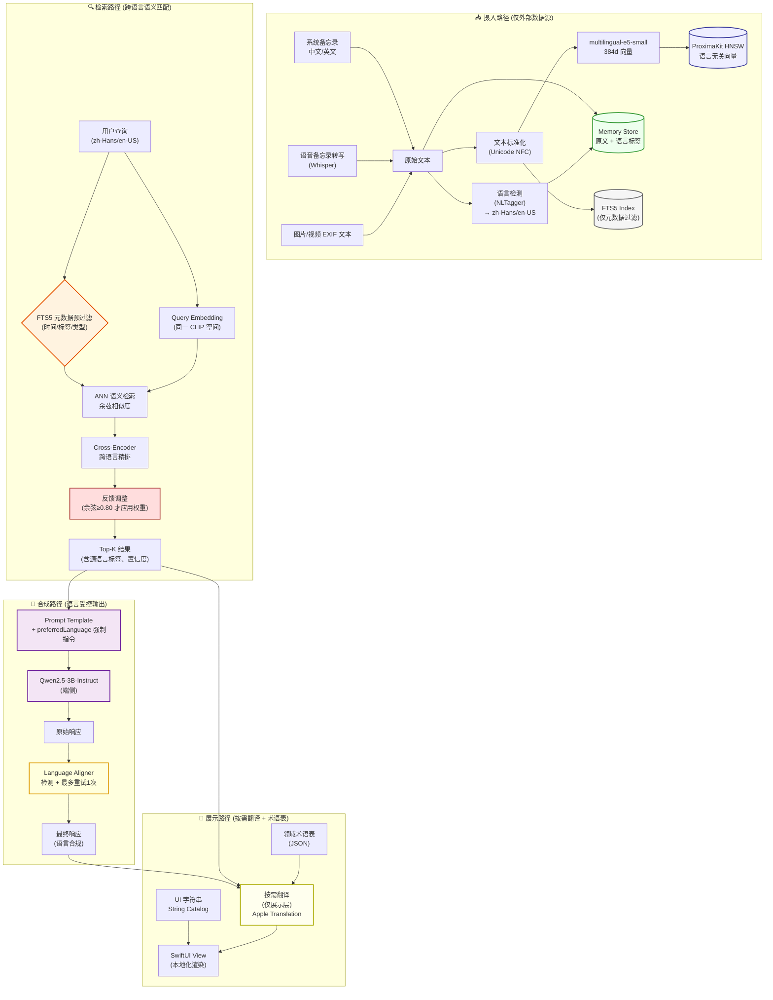
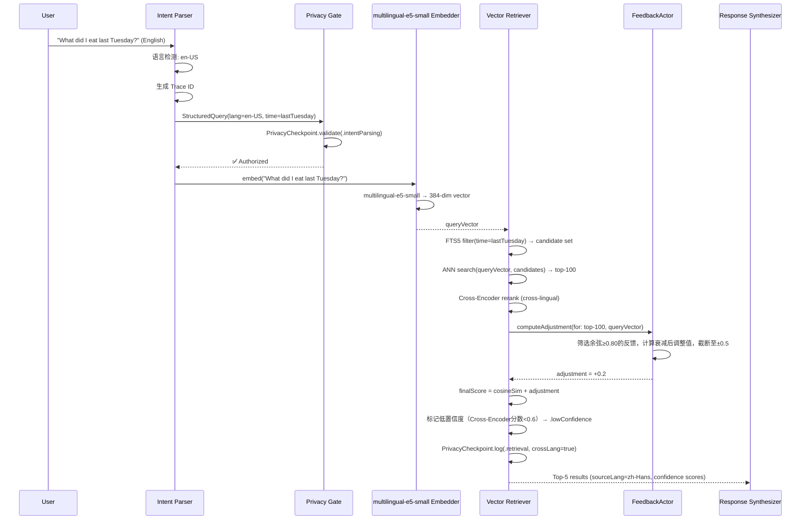
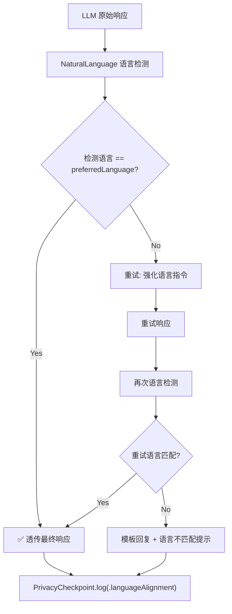

# Echo · 回响：跨语言语义对齐与双语实现技术说明文档

**版本**：v4.6

**生效日期**：2026-06-10

**适用架构**：Cognitive Pipeline + Observable ViewModel + Actor Isolation

**对应规格**：Echo v4.6 全量用户故事与验收标准规格书

**核心原则**：语义空间统一 > 存储语言无关 > 检索质量优先 > 显示本地化 > 审计可追溯

------

## 1. 跨语言设计哲学与全局约束

### 1.1 设计哲学

Echo 的双语能力是**语言无关的认知基础设施**。用户用中文查询英文记忆，或用英文查询中文记忆，是系统的默认行为而非特殊功能。

- **语义先于语言**：所有记忆在摄入时即映射到语言无关的向量空间，检索基于语义相似度而非词汇匹配。
- **存储与展示解耦**：原始文本以源语言不可变存储，展示时的语言转换是独立的渲染层操作，不修改底层数据。
- **索引语言中立**：全文索引仅作为元数据过滤辅助手段，核心检索路径完全依赖跨语言向量，避免 FTS 的语言偏向性。
- **AI 输出受控对齐**：合成响应的语言由 UserPolicy 显式控制（仅限 `zh-Hans` 或 `en-US`），而非由检索结果的语言隐式决定。
- **降级透明可审计**：当跨语言对齐失败时，系统明确告知用户并记录原因，而非静默返回低质量结果。

### 1.2 全局跨语言约束矩阵（v4.6 更新）

| 约束维度     | 规则                                                         | 验证方式                             | 违反后果                      |
| ------------ | ------------------------------------------------------------ | ------------------------------------ | ----------------------------- |
| 支持语言     | 仅 `zh-Hans` 和 `en-US`。繁体中文或其他方言自动映射为 `zh-Hans`，首次启动提示一次 | 启动时语言检查 + 审计                | PR 阻断                       |
| 向量空间     | 文本（E5 384d）与视觉（SigLIP2）使用**独立 generation + VectorStoreActor**，禁止跨空间直接对齐（ADR-006/ADR-009；v6.0 已弃用零填充对齐——调研报告判定为伪跨模态假设）。跨语言比较仅在**文本空间内**成立（E5 中英对齐） | 集成测试 + 跨语言召回率基准 (≥85%)   | PR 阻断                       |
| 原文存储     | 记忆原文以源语言不可变存储，禁止翻译后覆盖                   | 数据库 Schema 约束 + CI 扫描         | PR 阻断                       |
| 文本记忆来源 | 所有文本记忆仅来自**Share Extension 用户主动分享**的备忘录/语音备忘录转写（ADR-006/ADR-008，share-only；自动读取系统 Notes/Voice Memos 为私有 API，移出 v1），用户不可主动输入 | UI 组件检查（无新建文本入口）+ Share 摄入审计 | PR 阻断                       |
| FTS 角色     | FTS5 仅用于元数据过滤，不参与语义排序                        | Code Review + 检索单元测试           | PR 阻断                       |
| 输出语言     | AI 响应语言必须匹配 UserPolicy.preferredLanguage             | NaturalLanguage 运行时校验           | 自动重试 1 次，失败则模板降级 |
| 翻译触发     | 仅在展示层按需翻译，禁止在管线中间阶段翻译                   | 静态分析 + Trace 审计                | PR 阻断                       |
| 降级标记     | 跨语言对齐失败（对齐分数 <0.6）时必须携带 `.lowConfidence` 标记 | 审计日志完整性检查                   | PR 阻断                       |
| 术语一致性   | 领域术语翻译必须查询本地术语表，禁止 LLM 自由发挥            | Golden Dataset 术语覆盖率测试 (≥90%) | 测试失败                      |

------

## 2. 跨语言数据流全景图（v4.6）

------

## 3. 语言无关存储与索引机制（v4.6）

### 3.1 向量空间统一保障

跨语言检索的质量完全取决于 Embedding 模型的语义空间对齐程度：

- **文本模型**：multilingual-e5-small INT4，继承 100+ 语言对齐能力，原生 384d 嵌入。模型随 App 安装包分发，无网络下载。
- **视觉模型**：SigLIP2-B/32（R-5.1 转换中，768d）。与文本模型（E5 384d）维度不同，采用分离索引策略（v6.0 已弃用零填充对齐——调研报告判定为伪跨模态假设）。
- **对齐验证**：每次模型更新后，必须通过跨语言召回率基准测试（中英互检 Recall@10 ≥ 85%）。
- **降级兼容**：（当前无降级模型） 位于同一 CLIP 空间（仅为 S4 的同架构缩小型），确保设备过热/低电量时跨语言能力不退化。

### 3.2 原文存储策略（v4.6 强化）

Memory Store 中的每条记忆记录包含以下语言相关字段：

- `originalText`: 源语言原文，**不可变**，永不翻译覆盖。
- `sourceLanguage`: 语言标签，仅允许 `zh-Hans` 或 `en-US`。摄入时由 NLTagger 自动检测，若检测为繁体或其他方言，统一映射为 `zh-Hans` 并记录审计。
- `detectedConfidence`: 语言检测置信度，低于阈值时标记为 `.uncertain`。
- `translationCache`: 可选字段，缓存展示层翻译结果，TTL = 7天，过期自动清除。

> ⚠️ **铁律**：`originalText` 字段在任何情况下都不得被修改。所有语言转换操作仅写入 `translationCache` 或在展示层实时完成。此规则由数据库触发器与 CI 静态扫描双重保障。

### 3.3 FTS5 的角色限定（v4.6 重申）

FTS5 全文索引**仅用于元数据预过滤**，不参与语义排序：

- 支持的过滤维度：时间范围、标签、记忆类型、来源应用（备忘录/相册等）。
- **不支持**：基于关键词的语义匹配、跨语言词汇翻译。
- 分词器：中文使用 `unicode61` + `trigram`，英文使用 `porter` stemmer，但仅用于精确匹配过滤，不影响召回排序。
- 若用户查询包含明确的时间/标签约束，FTS5 先缩小候选集；否则跳过 FTS5，直接全量 ANN 检索。

### 3.4 存储层语言无关性验证

| 验证项                                 | 方法                      | 通过标准                  |
| -------------------------------------- | ------------------------- | ------------------------- |
| 中文原文存入后向量可被英文查询召回     | Golden Dataset 跨语言用例 | Recall@10 ≥ 85%           |
| 英文原文存入后向量可被中文查询召回     | Golden Dataset 跨语言用例 | Recall@10 ≥ 85%           |
| FTS5 过滤不改变语义排序结果            | A/B 测试（有/无 FTS5）    | NDCG@10 差异 < 1%         |
| 原文语言标签准确率（仅 zh-Hans/en-US） | NLTagger vs 人工标注      | ≥ 98%                     |
| translationCache 过期自动清除          | 定时任务 + 单元测试       | 100% 合规                 |
| 非支持语言输入被正确映射               | 集成测试（繁体输入）      | 映射为 zh-Hans + 审计记录 |

------

## 4. 跨语言检索管线详解（v4.6）

> 📌 **生产检索（3F.6，2026-08-11）**：生产检索管线已改为 generation 路由的多通道 RRF 融合——`SearchChannelAdapters` 按 `ActiveRouteSet` 逐通道解析对应代的 `VectorStoreActor`（text_dense E5 384d / vision_dense SigLIP2 768d / ocr_text / lexical，各通道独立向量空间，ADR-010），结果按 RRF 融合并以 ID-keyed 元数据回填；通道超时/空索引 → `timedOut` 部分结果（US-RET-008），不阻断其他通道；`SearchResultCacheActor` 提供 policy-aware TTL 缓存（US-RET-007）；追问查询 FIFO 历史 ≤10 + memoryIds 隐式过滤 + `.followUpQuery` 审计（US-RET-005，AC-3 延后 DEF-58-001）。跨语言检索的 query-conditioned 反馈重排保留（`computeAdjustment` 按 `queryText` 精确过滤，US-FBK-001 AC-4）。跨 App（US-SRC-010，`CrossAppIntentParser` + `CrossAppFusionEngine` 时间对齐融合 + `.crossAppSearch` 审计）与主观意图（US-SRC-011，`BoundedReranker` 有界重排）解析已落地。SigLIP2 视觉推理仍依赖 3F.3a Core ML 转换审批，vision/OCR 通道空索引降级为 timedOut 部分结果（不参与 Recall@10 全量门禁，保持 🔶）。

### 4.1 查询处理流程

> ⚠️ **基线标记（PR#58 CR-27）**：本节与 §4.2 为 **Phase 2 基线流程**（单一 Vector Retriever + Cross-Encoder 精排），已被上述 3F.6 生产路径取代——生产检索现为 generation 路由多通道 RRF 融合（§4 头部说明），Cross-Encoder 精排仅作为 Phase 2 参考。以下保留以说明历史设计。

### 4.2 跨语言精排关键点（v4.6 更新）

- **模型**：multilingual-e5-small Bi-Encoder（384d）用于向量生成与语义匹配。
- **输入格式**：`[CLS] query [SEP] document [SEP]`，query 与 document 语言可不同。
- **精排范围**：ANN 返回的 Top-100 候选，精排后取 Top-5（由 UserPolicy 定义）。
- **语言不敏感**：精排分数仅反映语义相关性，不受 query/document 语言组合影响。

### 4.3 反馈重排集成（v4.6 新增）

- **余弦阈值**：仅当 query 与记忆的余弦相似度 ≥ **0.80** 时，才应用反馈权重。
- **时间衰减**：超过 90 天的反馈权重 ×0.5；超过 180 天自动归档，不参与重排。
- **截断**：单条记忆的累积反馈调整上限为 ±0.5。
- **与跨语言的关系**：反馈权重独立于语言，点赞/点踩同样影响跨语言检索结果。

### 4.4 检索结果语言标记

每条返回结果携带完整的语言元信息：

- `sourceLanguage`: 原文语言标签（zh-Hans/en-US）。
- `crossLanguageMatch`: 布尔值，标识是否为跨语言匹配（query 语言 ≠ result 语言）。
- `alignmentScore`: 跨语言对齐置信度（Cross-Encoder 分数归一化，范围 0~1）。
- `fallbackReason`: 若对齐分数 <0.6，标记降级原因（如 `.lowConfidence`）。
- `feedbackAdjustment`: 反馈调整值（应用于重排，可追溯）。

------

## 5. AI 动态内容的语言控制机制（v4.6）

### 5.1 Prompt 语言指令注入

Response Synthesizer 在构造 Prompt 时，**显式注入语言控制指令**：

- 从 UserPolicy 读取 `preferredLanguage`（仅 `zh-Hans` 或 `en-US`）。
- 在 System Prompt 中追加：`"You MUST respond in {preferredLanguage}. Do NOT mirror the language of the retrieved context. Do NOT mix languages."`
- 在 User Prompt 末尾追加语言确认提示：`"[Language Requirement: {preferredLanguage}]"`
- 禁止在 Prompt 中包含“translate”等词汇，避免 LLM 误解为翻译任务。

### 5.2 Language Aligner 校验与重试（v4.6 重申）

- **首次检测**：使用 iOS 18 NaturalLanguage 框架，识别响应主体语言。
- **重试上限**：严格限制为 **1 次**，避免无限循环或延迟累积。
- **重试策略**：在 Prompt 中将语言指令从建议升级为强制，并附加示例输出格式。
- **降级模板**：预定义多语言模板，内容固定、不含 LLM 生成成分，确保语言合规。模板语言跟随 `preferredLanguage`。
- **审计全覆盖**：无论成功、重试成功或降级，均记录完整语言对齐轨迹（含 `languageRetryCount`）。

### 5.3 混合语言上下文处理

当检索结果包含多种语言时，Synthesizer 的处理策略：

- **不翻译上下文**：将多语言原文直接注入 Prompt，依赖 LLM 的跨语言理解能力。
- **语言优先级**：Prompt 中明确指示“以 preferredLanguage 生成响应，忽略上下文的语言多样性”。
- **引用标注**：若响应中引用了非 preferredLanguage 的原文片段，必须标注源语言标签（如 `[en-US]`）。
- **禁止混合输出**：最终响应不得出现 preferredLanguage 以外的句子级语言切换（专有名词、引用除外）。

------

## 6. 显示层双语实现机制（v4.6）

### 6.1 UI 静态字符串本地化

- 使用 Xcode 16 String Catalog 管理，支持复数、性别、上下文注释。
- 键名采用语义化命名（如 `memory.detail.emptyState`），禁止使用英文原文作为键。
- 缺失翻译时回退至 Base Language（英文），并在 Debug 构建中高亮提示。
- 所有 UI 字符串必须通过 `LocalizedStringKey` 访问，禁止硬编码。
- 仅提供 `zh-Hans` 和 `en-US` 两个版本，不包含繁体或其他方言。

> **3F.10 实现（2026-08-12，v5.27）**：本地化载体落地为 `Echo/Resources/Localizable.xcstrings`（`sourceLanguage: en-US`，336 keys，zh-Hans/en-US 100% parity），键使用英文源文案（Xcode String Catalog 默认形态，与既有 i18n-deferred 迁移模式一致，覆盖 DEF-41-1/42-002/43-001/44-001/45-001/46-001/52-001/60-001）。统一语言由 `LanguageCenter`（`Echo/UI/AppShell/AppViewModel.swift`）驱动：单一 App 语言设置同时写 `UserPolicy.preferredLanguage`（AI 语言，R-004）与 UI 解析语言；视图经 `EchoStrings.tr(key)`（显式 `.lproj` 子包查找，`EchoLocalization`）解析，`AppRootView` 同步注入 `.environment(\.locale)` 使 `Text(LocalizedStringKey)` 立即重解析（US-DIS-001 AC-4 无重启）。`Scripts/validate_localization.py` 门禁校验 catalog parity 100% 与视图零硬编码。

### 6.2 领域术语表机制（v4.6 强化）

为确保 AI 内容与 UI 内容的术语一致性，维护独立的领域术语表：

- 格式：JSON，结构为 `{ "term_key": { "zh-Hans": "...", "en-US": "..." } }`。
- 覆盖范围：产品功能名称、认知管线阶段名、隐私策略术语、错误码描述。
- **展示层翻译优先查术语表**：命中则直接使用，未命中再调用 Apple Translation。
- **AI 生成内容术语注入**：在 Prompt 中附带当前上下文的术语表子集，约束 LLM 用词。
- 术语表变更需同步更新 String Catalog 与 Golden Dataset。术语覆盖率 Golden Dataset 要求 ≥90%。

### 6.3 按需翻译触发条件（v4.6 重申）

展示层翻译**仅在以下场景触发**，禁止提前或过度翻译：

| 场景          | 触发条件                                       | 翻译目标     | 缓存策略                 |
| ------------- | ---------------------------------------------- | ------------ | ------------------------ |
| 记忆详情页    | 用户点击展开非 preferredLanguage 记忆          | 单条记忆原文 | translationCache, TTL=7d |
| 搜索结果摘要  | 结果语言 ≠ preferredLanguage 且摘要长度 > 阈值 | 摘要片段     | 不缓存，实时翻译         |
| AI 响应引用   | 引用片段语言 ≠ preferredLanguage               | 引用片段     | 随响应生命周期           |
| 错误/降级提示 | 系统消息语言 ≠ preferredLanguage               | 整条消息     | String Catalog 预置      |
| 导出文件      | 用户选择导出语言 ≠ 源语言                      | 全部内容     | 一次性，不缓存           |

### 6.4 翻译质量保障

- **首选**：Apple Translation Framework（iOS 18+ 端侧翻译，隐私安全）。
- **备选**：术语表精确匹配。
- **禁止**：调用任何云端翻译 API。
- **质量兜底**：源语言检测不确定（NLTagger 置信度 < 0.9，标记 `.uncertain`）时，保留原文 + 语言标签，不提供译文——翻译方向可能错误时宁可退回原文。译文本身无置信度评分（Apple Translation 不返回质量分数，见 ADR-005），以语言检测确定性作为翻译方向可靠性的代理信号。
- **用户控制**：用户可手动切换“显示原文/显示译文”，偏好持久化存储。

### 6.5 唤醒卡感受文本边界（US-AWK-005 / Phase 4 `4.0d`）

- `userFeelings.text` 按用户输入原文存储到 `MemoryFeeling` 关系表，领域 API 才映射为 `userFeelings` 集合。感受不自动翻译、不改写，也不写入 Memory/Representation/FTS/向量索引/翻译缓存；因此不得被用户搜索或计入跨语言 Recall。
- “记录感受”、查看、编辑、删除、下一张、“匹配此设备音乐”、权限拒绝和离线降级等 UI 文案必须来自 zh-Hans/en-US String Catalog；用户输入内容不因 UI 语言切换而变化。
- 系统内部情绪/个性化分析可读取原文，但仅在本地运行；若需要语言检测，仍只归一化为 zh-Hans/en-US，审计只能记录 hash、语言标记与必要 action metadata，不记录感受原文。
- 删除感受后的个性化刷新遵循 US-AWK-005 AC-4，不触发新的独立记忆摄入或展示层翻译缓存。

------

## 7. 跨语言审计与可观测性（v4.6）

### 7.1 审计记录扩展字段（v4.6 更新）

所有涉及跨语言操作的 PrivacyCheckpoint 记录，额外包含以下字段（与规格书附录 15 对齐）：

| 字段                 | 类型     | 描述                            |
| -------------------- | -------- | ------------------------------- |
| `queryLanguage`      | String   | 查询语言标签（zh-Hans/en-US）   |
| `resultLanguages`    | [String] | 结果语言标签数组                |
| `isCrossLingual`     | Bool     | 是否跨语言匹配                  |
| `alignmentScore`     | Double   | 跨语言对齐分数（Cross-Encoder） |
| `outputLanguage`     | String   | 最终输出语言标签                |
| `languageRetryCount` | Int      | 语言对齐重试次数（0 或 1）      |
| `translationTrigger` | String   | 展示层翻译触发原因枚举          |
| `termTableHit`       | Double   | 术语表命中率（0~1）             |
| `feedbackApplied`    | Bool     | 是否应用了反馈重排              |
| `lowConfidence`      | Bool     | 是否标记低置信度                |

### 7.2 跨语言质量监控指标（v4.6 更新）

| 指标                 | 计算方式                         | 告警阈值 | 用途            |
| -------------------- | -------------------------------- | -------- | --------------- |
| 跨语言召回率         | 跨语言 Golden Dataset Recall@10  | < 80%    | 模型退化预警    |
| 语言对齐成功率       | (成功 + 重试成功) / 总请求       | < 95%    | Prompt 优化信号 |
| 术语表命中率         | 术语表命中次数 / 翻译请求总数    | < 70%    | 术语表扩充信号  |
| 展示层翻译延迟       | P95 翻译耗时                     | > 500ms  | 性能优化信号    |
| 跨语言低置信度率     | 携带 `.lowConfidence` 的结果占比 | > 5%     | 数据质量排查    |
| 非支持语言输入映射率 | 繁体/方言→zh-Hans 的审计记录比例 | 无告警   | 产品行为验证    |

### 7.3 Trace 链路语言视图

在调试工具中，每条 Trace 提供专门的语言视图：

- 可视化展示 query → retrieval → synthesis → display 各阶段的语言标签流转。
- 高亮标记跨语言匹配点与语言对齐决策点。
- 支持按语言组合筛选 Trace（如“英文查询 + 中文结果 + 英文输出”）。

------

## 8. 异常与降级数据流（跨语言专项，v4.6）

### 8.1 跨语言特有异常处理

| 异常类型                      | 检测点                        | 处理策略                                                     | 用户感知                                             |
| ----------------------------- | ----------------------------- | ------------------------------------------------------------ | ---------------------------------------------------- |
| 语言检测失败                  | Intent Parser / Memory Ingest | 标记 `.uncertain`，按 Unicode 范围启发式推断（zh-Hans/en-US） | 无感知，审计记录标记                                 |
| 跨语言对齐分数过低（<0.6）    | Retriever Rerank              | 保留结果但标记 `.lowConfidence`，UI 显示统一提示文案         | “以下结果相关性较低，建议优化关键词或尝试不同表述。” |
| LLM 语言指令遵循失败          | Language Aligner              | 重试 1 次 → 模板回复                                         | “正在切换语言…” → 模板回复                           |
| 端侧翻译不可用                | Display Layer                 | 保留原文 + 语言标签                                          | 原文旁显示语言图标                                   |
| 源语言检测不确定（<0.9）      | Display Layer                 | 保留原文 + 语言标签，不提供译文（翻译方向不可靠，ADR-005）  | 原文旁显示语言图标                                   |
| 术语表缺失关键术语            | Display Layer / Synthesizer   | 回退 Apple Translation + 审计标记                            | 无感知，后台告警                                     |
| 混合语言上下文超出 Token 限制 | Synthesizer                   | 按 alignmentScore 截断低分片段                               | 无感知，审计记录截断详情                             |

### 8.2 降级透明性原则（v4.6 重申）

- 所有跨语言降级必须在 UI 上有可感知的指示（图标、文字提示、置信度标签）。
- 禁止静默返回低质量跨语言结果。
- 用户可对降级结果提供反馈（👍/👎），反馈作为 `AppEffect.feedback(crossLangIssue:)` 进入 FeedbackPipeline。

------

## 9. 验证与质量保障（跨语言专项，v4.6）

### 9.1 跨语言 Golden Dataset 要求（v4.6 更新）

- **支持语言**：仅 `zh-Hans` 和 `en-US`。
- **覆盖矩阵**：{zh-Hans, en-US} × {query, memory} × {exact, fuzzy, emotional, factual} = 16 基础组合（因不支持混合语言查询外的其他语言）。
- **每组至少 50 条用例**，总计 ≥ 800 条跨语言测试用例。
- 每条用例包含：查询语言、查询文本、预期匹配记忆（含源语言）、预期输出语言、预期对齐分数范围（>0.6）、预期术语表命中项。
- 数据集每季度更新，纳入真实用户反馈中的跨语言 bad case。

### 9.2 自动化验证层级（跨语言扩展）

| 层级     | 新增验证项                 | 通过标准                   |
| -------- | -------------------------- | -------------------------- |
| 单元测试 | Embedder 跨语言向量相似度  | 同义跨语言对 cosine > 0.85 |
| 集成测试 | 端到端跨语言检索 + 合成    | 语言对齐成功率 ≥ 99%       |
| 性能测试 | 跨语言精排延迟             | P95 < 200ms                |
| 审计测试 | 跨语言审计字段完整性       | 100% 填充                  |
| 术语测试 | 术语表覆盖率               | ≥ 90% 高频术语命中         |
| 展示测试 | 翻译触发条件合规性         | 0 违规触发                 |
| 反馈测试 | 反馈重排对跨语言结果的影响 | 人工评估 + 召回率变化 ≤5%  |

### 9.3 人工评估流程

- 每月抽取 100 条跨语言 Trace 进行人工评估。
- 评估维度：检索相关性、输出语言合规性、术语准确性、翻译自然度。
- 评估结果反馈至 Golden Dataset 与 Prompt 优化循环。

------

## 10. 附录：跨语言相关 ADR 索引（v4.6 更新）

| ADR 编号 | 标题                                                  | 状态     | 日期       |
| -------- | ----------------------------------------------------- | -------- | ---------- |
| ADR-013  | 采用 CLIP 共享空间实现语言无关检索                    | Accepted | 2026-05-27 |
| ADR-014  | FTS5 仅限元数据过滤，不参与语义排序                   | Accepted | 2026-05-29 |
| ADR-015  | AI 输出语言由 UserPolicy 显式控制（仅 zh-Hans/en-US） | Accepted | 2026-05-31 |
| ADR-016  | 展示层翻译按需触发，禁止管线内翻译                    | Accepted | 2026-06-02 |
| ADR-017  | 领域术语表独立于 String Catalog 管理                  | Accepted | 2026-06-04 |
| ADR-018  | 跨语言对齐失败必须透明降级（低置信度阈值 0.6）        | Accepted | 2026-06-05 |
| ADR-019  | 用户不可主动输入文本记忆，所有文本来自外部数据源      | Accepted | 2026-06-07 |
| ADR-020  | 反馈学习仅应用于余弦相似度 ≥0.80 的结果               | Accepted | 2026-06-08 |
| ADR-021  | 移除繁体中文和方言支持，统一映射为 zh-Hans            | Accepted | 2026-06-09 |

> **文档维护声明**
>
> 本文档定义了 Echo v4.6 跨语言语义对齐与双语实现的权威技术规范。所有跨语言机制变更必须通过 ADR 流程审批并同步更新本文档。跨语言质量评审委员会每月复审一次，确保检索质量、输出合规性与用户体验保持同步演进。
>
> 下次全面复审日期：2026-09-30（与规格书 v4.6 复审同步）。
