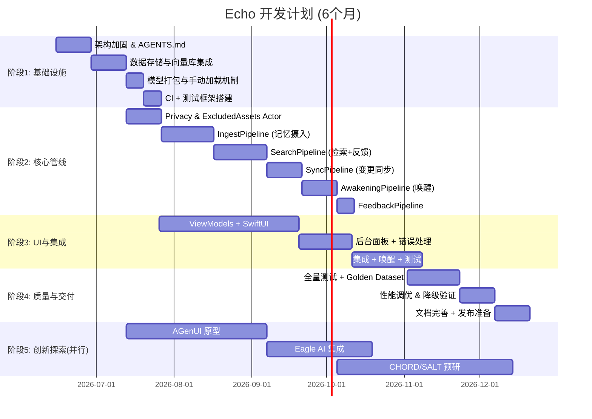
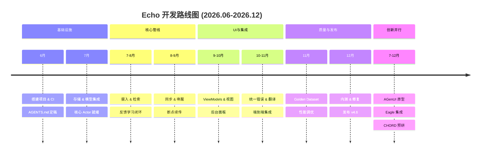
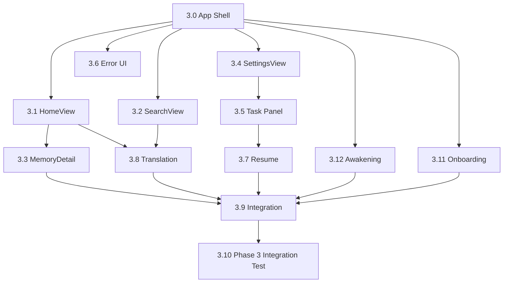

# Echo · 回响：开发计划安排文档

**版本**：v1.3

**生效日期**：2026-06-15（最后更新：2026-08-31）

**对应规格**：Echo v4.6 全量用户故事与验收标准规格书

**项目代号**：Echo v4.6 实现 + 创新探索

**目标周期**：6 个月（2026-06-15 至 2026-12-15）

------

## 1. 项目目标与范围

### 1.1 核心目标

基于 Echo v4.6 规格书，实现一个 **本地优先、隐私可审计、认知管线驱动、完全离线可用** 的端侧 AI 记忆助手，并完成从规格到代码的完整落地。同时预留 20% 资源用于创新工具的技术预研与原型探索。

### 1.2 范围限定

- **包含**：v1 已批准范围内的 P0/P1 功能；核心架构（Cognitive Pipeline + Actor + Observable ViewModel）；CI/CD 与自动化测试；Agent 协作开发流程；至少两个创新工具的隔离研究原型。
- **待产品决策**：AWK-004（Widget / Live Activity）与 AWK-006（Siri / App Intents）仍由 DEF-001/DEF-002 追踪。它们没有对应的 Phase 4 实现任务，因此 `4.10` Release Candidate 在二者被实现，或由产品负责人正式移出 v1 并同步规格/故事矩阵之前保持阻断。
- **不包含**：未经批准的第三方生产 API、Android 或其他平台移植、商业化部署。Phase 5 外部工具只允许隔离研究，不得成为 Echo 生产依赖或突破 R-001/R-005。
- **延期追踪**：`docs/05-planning/deferred-items.json` 记录所有延后到后续 Phase 的任务。

------

## 2. 总体时间线与里程碑

### 2.1 里程碑清单

| 里程碑             | 日期       | 可交付成果                                                   |
| ------------------ | ---------- | ------------------------------------------------------------ |
| M0: 架构定型       | 2026-06-28 | `AGENTS.md` v1.0，核心 Actor 设计评审通过                    |
| M1: 核心存储可用   | 2026-07-11 | ProximaKit + SQLite 集成，`ExcludedAssets` 表就绪，模型手动加载验证 |
| M2: 隐私与摄入完成 | 2026-08-01 | `PrivacyActor`, `ExcludedAssetsActor`，`IngestPipeline` 支持图片/视频/备忘录/语音 |
| M3: 检索与反馈闭环 | 2026-08-22 | `SearchPipeline` 支持跨语言检索 + 反馈重排，`FeedbackPipeline` 可写 SQLite |
| M4: 同步与唤醒就绪 | 2026-09-19 | `SyncPipeline` 监听变更，`AwakeningPipeline` 支持地理/日期/情绪唤醒 |
| M5: UI 完整可用    | 2026-10-10 | 所有 ViewModel + SwiftUI 视图完成，后台任务面板实时更新，引导流程就绪 |
| M6: 全功能稳定版   | 2026-11-20 | 通过全部 Golden Dataset 与性能门禁，内部测试无未解决 P0/P1 crash |
| M7: 发布候选       | 2026-12-08 | 完成文档、Live Review 证据、唯一 RC 与 TestFlight 分发       |
| M8: 创新原型 Demo  | 2026-12-15 | 至少两个隔离创新原型与可行性评估，不进入生产依赖图           |

### 2.2 缺陷修复计划（2026-07 审计后新增）

> 依据《Echo dev-1.0 当前缺陷审计报告.md》与《Echo 端侧模型选型与升级调研报告（2026）》（四项决策已批准）制定。详见 `Echo dev-1.0 缺陷修复计划.md`。

| Phase | 内容 | 状态 | 完成日期 |
|-------|------|------|---------|
| **R-0** | CI 构建与测试门禁修复（pipefail/destination/R-007/警告冲突/pxkt） | ✅ 已完成 | 2026-07-31 |
| **R-A** | 架构数据模型：规范 Memory/Representation + ModelManifest + IndexGeneration + ActiveRouteSet | ✅ 已完成 | 2026-07-31 |
| R-1 | 数据正确性与隐私状态缺陷（8 项） | ✅ 已完成 | 2026-08-01 |
| R-2 | 任务状态账本 + CI 质量门禁（11 项） | ✅ 已完成 | 2026-08-01 |
| R-3 | AI 运行时 Stub → 生产（E5 384d 独立索引 + SigLIP2 视觉 + Whisper ASR + OCR + 词法 + RRF） | ✅ Phase 3F 已完成生产接线；最终模型许可、SBOM、性能与发布制品复核归 Phase 4 | 2026-08-31 |
| R-4 | 模型准备脚本与资产可复现性（5 项） | ✅ 已完成 | 2026-08-01 |
| R-5 | 外部阻断（SigLIP2 许可 / iOS API 限制 / People 身份缺口 / Whisper 法律审查） | ✅ 已决策（B-A-1-B） | 2026-08-01 |

> **修复计划与阶段任务的关系**：修复计划为审计驱动的增量交付，独立于 Phase 1~5 的常规任务编排。R-A 交付的架构数据模型是调研报告决策 1 的落地，为 Phase R-3 的模型升级提供分代索引底座。

------

## 3. 阶段详细任务分解

### 阶段1：基础设施搭建（4周，6月15日-7月12日）

| 任务ID | 任务名称                                                     | 产出                                    | 负责人角色      | 预估工时(人日) | 依赖 |
| ------ | ------------------------------------------------------------ | --------------------------------------- | --------------- | -------------- | ---- |
| 1.1    | 创建 Xcode 项目，配置 Swift 6 并发严格模式                   | `-strict-concurrency=complete` 编译通过 | iOS 架构师      | 2              | 无   |
| 1.2    | 编写根目录 `AGENTS.md`，整合避坑手册核心规则                 | `AGENTS.md` 被 Codex 识别               | 技术负责人 + AI | 3              | 无   |
| 1.3    | 集成 ProximaKit HNSW，封装 `VectorStoreActor`                | 向量增删改查 API                        | 后端/存储工程师 | 5              | 1.1  |
| 1.4    | 集成 SQLite，创建 `ExcludedAssets`, `Feedback`, `TaskProgress`, `PendingOperations` 表 | SQLite 封装 Actor                       | 后端工程师      | 4              | 1.1  |
| 1.5    | 将 multilingual-e5-small, Whisper GGUF, SigLIP2 checkpoint 打包到 Bundle（v6.0 路线） | 模型文件存在于 App 资源目录（由 Scripts/prepare_models.sh 下载） | 模型工程 | 3 | 无 |
| 1.6    | 实现 `ModelLoaderActor` 手动加载/重试机制                    | 加载失败不自动重试，提供手动按钮接口    | iOS 工程师      | 3              | 1.5  |
| 1.7    | 搭建 CI（GitHub Actions）：SwiftLint, 单元测试, 覆盖率       | 每次 PR 自动检查                        | DevOps          | 3              | 1.1  |
| 1.8    | 搭建单元测试框架，编写第一个 Actor 测试用例                  | `PrivacyActor` 测试通过                 | 测试工程师      | 2              | 1.2  |

**阶段交付**：可运行的空 App，基础 Actor 可注入，模型可手动加载，CI 通过。

### 阶段2：核心认知管线（10周，7月13日-9月20日）

| 任务ID | 任务名称                                                 | 产出                                     | 负责人     | 工时 | 依赖     |
| ------ | -------------------------------------------------------- | ---------------------------------------- | ---------- | ---- | -------- |
| 2.1    | `PrivacyActor` + `UserPolicy` 实现                       | 授权校验、审计 checkpoint                | iOS 工程师 | 4    | 1.4      |
| 2.2    | `ExcludedAssetsActor` 实现（含恢复、一键恢复、变更监测） | 符合 US-SRC-008                          | iOS 工程师 | 5    | 1.4      |
| 2.3    | `IngestPipeline`：图片摄入（US-ING-004）                 | 向量化 + 存储                            | AI 工程师  | 6    | 2.1, 1.3 |
| 2.4    | `IngestPipeline`：视频摄入（US-ING-005）                 | 帧采样 + 音频转写                        | AI 工程师  | 6    | 2.3, 1.6 |
| 2.5    | `IngestPipeline`：备忘录 + 语音转写（US-ING-001~003）    | 文本摄入                                 | AI 工程师  | 5    | 2.3      |
| 2.6    | `SearchPipeline`：向量检索 + FTS5 过滤                   | 基础检索能力                             | AI 工程师  | 6    | 2.3      |
| 2.7    | `FeedbackActor` + 重排公式                               | 反馈写入，权重计算（阈值0.80，截断±0.5） | iOS 工程师 | 5    | 1.4      |
| 2.8    | 集成反馈到 `SearchPipeline`                              | 动态排序                                 | AI 工程师  | 4    | 2.6, 2.7 |
| 2.9    | 跨语言低置信度降级（US-RET-006）                         | `.lowConfidence` 标记 + UI 提示          | AI 工程师  | 3    | 2.6      |
| 2.10   | `SyncPipeline`：相册变更监听 + 增量替换                  | 符合 US-SRC-012                          | iOS 工程师 | 8    | 2.3, 2.2 |
| 2.11   | `AwakeningPipeline`：地理围栏（US-AWK-001）              | 监听进入/离开，推送卡片                  | iOS 工程师 | 6    | 2.6      |
| 2.12   | `AwakeningPipeline`：情绪唤醒（US-AWK-003）              | HealthKit + 文本情感，防抖缓存           | AI 工程师  | 6    | 2.6, 1.2 |
| 2.13   | `FeedbackPipeline`：点赞/点踩/Bad Case 记录              | 完整反馈闭环                             | iOS 工程师 | 4    | 2.7      |

**阶段交付**：所有 P0/P1 Pipeline 单元测试通过，可通过 CLI 或临时 UI 验证检索、摄入、同步、唤醒流程。

### 阶段3：UI 与集成（12周，7月26日-10月18日）

> **任务重构**：2026-07-26 全面审计后发现原 10 个任务不足以覆盖所有 UI 需求。扩充为 13 个任务，增加 App Shell（3.0）、引导流程（3.11）、唤醒投递（3.12），扩展 3.1-3.6/3.9 范围。详见 `task-status.json` 和 `deferred-items.json`。

| 任务ID | 任务名称 | 产出 | 覆盖故事 | 工时 | 依赖 |
|--------|---------|------|----------|------|------|
| **3.0** 🆕 | App Shell：TabView + NavigationStack + DI 注入 | 根导航框架 | — | 3 | 无 |
| **3.11** 🆕 | 引导流程：欢迎页 + PIPL 隐私同意 + 权限序列 + 语言选择 + 首次模型加载 | 5 步全屏引导 | PRV-008, SRC-001, SYN-001 | 5 | 3.0, 1.6 |
| **3.1** 📝 | 主视图 HomeView + HomeViewModel + 唤醒卡片 + 离线模式指示器 | Discovery masonry 首页 | AWK-001/002/003/005, RES-001 | 6 | 3.0, 2.11 |
| **3.2** 📝 | 检索视图 SearchView + SearchViewModel + 反馈按钮 + 低置信度横幅 + 手动扫描结果页 | 搜索 + 筛选 + 反馈 | RET-001/004/006/008, FBK-001/003, SRC-005/013 | 7 | 3.0, 2.6 |
| **3.3** 📝 | 记忆详情页 MemoryDetailView + ViewModel + 编辑 + 冲突解决 + 创作展示 | Focus 详情页 | AWK-007, SYN-002/003/004, PRV-004, DIS-002 | 7 | 3.0, 2.3, 3.1 |
| **3.4** 📝 | 设置页面 SettingsView + ViewModel（数据源开关、排除项、审计日志、模型状态、反馈记录、迁移） | Task 设置页 | SRC-004/007/008/009, PRV-002/003/005, RES-004, SET-001~004, FBK-002 | 9 | 3.0, 2.2, 1.4, 1.6 |
| **3.5** | 实时后台任务面板 | 进度展示 + 暂停/取消 | SYS-001 | 6 | 3.4, 2.10 |
| **3.6** 📝 | 统一错误处理 UI（L1~L4）+ 空态/加载态 + 降级横幅 + 冷却期提醒 | 完整错误矩阵 | DIS-003, RES-002/003/004, SYN-008, PRV-005 | 6 | 3.0, 2.1, 2.7 |
| **3.7** | 断点续传集成到长任务 | 继续/重新开始弹窗 | — | 5 | 3.5, 1.4 |
| **3.8** | 跨语言翻译层集成 | 翻译切换 + 术语表 | DIS-002 | 4 | 3.1, 3.2 |
| **3.9** 📝 | 整合所有 ViewModel 与 Pipeline + 创作保存 UI | 端到端业务流 | SYN-003/004/005 | 6 | 3.1~3.8 |
| **3.12** 🆕 | 唤醒投递：本地通知 + 位置/健康权限 + 地理围栏设置 | 通知 + 权限流 | AWK-001/002/003 | 5 | 3.0, 2.11, 2.12 |
| **3.10** | Phase 3 集成测试：UI 与 Pipeline 联调验证 | 全量回归 | 全部 | 5 | 3.0~3.9, 3.11, 3.12 |

> 🆕 新增 | 📝 范围扩展（2026-07-26 审计后）

**阶段交付**：完整 Echo 应用，App Shell + 引导流程 + 5 大页面（Home/Search/Detail/Settings/TaskPanel），后台任务透明，错误处理符合 L1-L4 矩阵，所有 44 个 UI 相关用户故事 AC 通过，跨 Surface 旅程通畅。

### 阶段3F：功能完成与生产集成（2026-08，已完成）

> **账本变更（3F.0 落地）**：`current_phase` 为字符串 `"3F"`，`phase_order = ["1","2","3","3F","4","5"]`。Phase 3 保持 `done`，说明修订为「UI 与可注入交互切片完成，不代表生产功能完成」。本阶段在默认 Echo App 路径上完成生产功能闭环（同意、真实来源、真实模型、规范存储、摄入、检索、反馈、编辑/删除、唤醒、翻译/创作、重启恢复），以 **`3F.11` 的无 fixture 生产 E2E 门禁作为 Phase 4 的唯一入口**（Phase 4 `entry_gate: "3F.11"`）。

| 任务ID | 任务名称 | 产出（高层面） | 测试文件 |
|--------|----------|----------------|----------|
| 3F.0 | 规格、范围、账本与接口冻结 | 冻结范围、创建 phase3f 规划文档与 ADR-006..014（docs-only） | — |
| 3F.1 | Production composition、首次启动、同意与隐私 | 无 fixture 新装、deny-by-default、审计契约 | `EchoTests/Phase3F/3F.1_ProductionCompositionTests.swift` |
| 3F.2 | PhotoKit、Share Extension 与真实来源 | 真实 PhotoKit/Share 摄入、权限撤回（自 4.20 迁入） | `EchoTests/Phase3F/3F.2_RealDataSourcesTests.swift` |
| 3F.3 | E5、SigLIP2、Whisper 与离线生成决策落地 | 生产模型推理、SBOM 与零网络证据（自 4.21/4.22 迁入） | `EchoTests/Phase3F/3F.3_ProductionModelInferenceTests.swift` |
| 3F.4 | Canonical storage 与 generation 生命周期 | 迁移、原子发布、rollback 与事务删除 | `EchoTests/Phase3F/3F.4_CanonicalGenerationTests.swift` |
| 3F.5 | Production ingestion | 四类真实来源 trace、取消重启恢复 | `EchoTests/Phase3F/3F.5_ProductionIngestionTests.swift` |
| 3F.6 | Production search 与 feedback | 检索通道、反馈重排、PendingOperations 手工重试 | `EchoTests/Phase3F/3F.6_ProductionSearchFeedbackTests.swift` |
| 3F.7 | UI 到 Core 全域接线 | 默认 live adapter、跨 surface journey、设备迁移（US-SRC-007） | `EchoTests/Phase3F/3F.7_UIToCoreIntegrationTests.swift` |
| 3F.8 | Awakening 与 system adapters | HealthKit 最小化、通知边界 | `EchoTests/Phase3F/3F.8_AwakeningSystemAdaptersTests.swift` |
| 3F.9 | Apple Translation 与 grounded creation | 翻译 availability、创作/导出边界 | `EchoTests/Phase3F/3F.9_TranslationCreationTests.swift` |
| 3F.10 | i18n、accessibility 与 production errors | 双语 catalog 100%、AX、L1-L4 | `EchoTests/Phase3F/3F.10_LocalizationAccessibilityErrorTests.swift` |
| 3F.11 | Production E2E 与 Phase 4 准入门禁 | no-fixture 功能闭环、Release build、基线质量与 per-target 合规（阶段集成测试） | `EchoTests/Phase3F/Phase3FIntegrationTests.swift` |

**Phase 4 准入门禁（已通过）**：PR #63 于 2026-08-26 由 `logan-suu` 合并到 `dev-1.0`，merge commit `18784ea426d411ab539c5bd9c0eecd4548ae7e7a`。2026-08-31 人类产品负责人确认基本生产闭环可作为 `3F.11` 完成边界，`3F.finalize` 将 `current_phase` 改为 `"4"` 并只解锁 `4.1`~`4.9`。

**Phase 4/5 任务重排（随 3F.0 账本迁移落地）**：
- `4.20` → `3F.2`（PhotoKit、Share Extension 与真实来源）
- `4.21`、`4.22` → `3F.3`（SigLIP2 / Whisper 生产推理决策落地）
- `4.12`、`4.13`、`4.23`、`4.24`、`4.25` → `5.6`..`5.10`（R-3.9 挑战者赛道移入 Phase 5 并行研究）
- `5.5` → `5.11`（Phase 5 集成测试重新编号）
- `3F.finalize` 最初解锁 14 个发布资格任务（4.1..4.14）；2026-08-31 人类批准全 App 平衡画布后新增任务族 `4.0`/`4.0a`/`4.0b`/`4.0c`；2026-09-01 两轮规格审查分别新增 US-AWK-005 生产闭环 `4.0d` 与 Focus 生产动作/来源闭环 `4.0e`，Phase 4 共 20 个任务。`4.0` 只负责共享基础与 AppShell；完成后 Discovery、Focus、Task 三个页面族任务可并行，`4.0d`/`4.0e` 分别补齐不能由视觉任务或测试任务替代的生产行为。消费最终 UI 的下游任务按实际范围依赖对应任务，不再被单个巨型任务阻塞

**阶段交付**：默认 App 已完成同意、真实来源、真实模型、规范存储、摄入、检索、反馈、编辑/删除、唤醒、翻译/创作、重启恢复的基本闭环。`3F.11` 证据证明 unsigned Release build、基线 coverage、隐私/合规扫描和 no-fixture E2E；它不宣称全局覆盖率 `>=95%`、受控签名/archive、最终 App Icon、Golden/性能或最终 RC 已完成，这些属于 Phase 4。

**规划文档**：`docs/05-planning/phase3f-execution-plan.md`（执行指令）、`phase3f-story-matrix.md`（故事归属）、`phase3f-evidence-index.md`（证据索引）；决策见 `docs/decisions/ADR-006`~`ADR-014`。

### 阶段4：质量保障与发布准备（当前阶段）

> Phase 4 以发布资格为主，不重复开发 Phase 3F 已完成的基本业务闭环。新增产品范围包括人类批准的平衡画布任务族 `4.0`/`4.0a`/`4.0b`/`4.0c`，以及规格审查确认尚未完成的 US-AWK-005 生产闭环 `4.0d` 和 Focus 生产动作/来源闭环 `4.0e`；其余任务仍负责验证、加固和发布。只有 `4.0`~`4.0e` 与 `4.1`~`4.9` 全部完成后才能生成唯一 RC。`task-status.json` 是任务状态、依赖与证据字段的唯一权威。

**延期项路由**：3F 完成后仍为 `open`/`partial` 且原目标已结束的审查项已重新绑定到真实消费任务：检索/反馈质量 → `4.1`，生产 E2E/迁移/依赖图 → `4.2`，任务恢复 → `4.4`，原子清除 → `4.5`，coverage/静态门禁 → `4.6`，模型 provenance/发布导出 → `4.9`，产品范围决策 → `4.10`。对应任务必须读取 `deferred-items.json`，不得把“3F 已完成”解释为这些条目自动关闭。

| 任务ID | 任务名称 | 主要产出 | 依赖/启动条件 |
| ------ | -------- | -------- | ------------- |
| 4.0 | 平衡画布设计系统与 AppShell 基础 | DesignProfile、共享 token/component、Apple 原生 AppShell | 3F.11 |
| 4.0a | Discovery 平衡画布：Home 与 Search 真实数据 | Home 0/1~19/20+、Search 确定性 eligibility、adaptive masonry 与单列回退 | 4.0 |
| 4.0b | Focus 平衡画布：Detail、Creation 与 Translation | 单列主内容、引用卡片、grouped metadata，同源非 masonry 表达 | 4.0 |
| 4.0c | Task 平衡画布：设置、引导与运行状态页面 | 六个 Task 功能域统一 grouped container、状态与动作层级 | 4.0 |
| 4.0d | 交互式唤醒卡生产闭环 | US-AWK-005 媒体/音乐、下一张、感受持久化、来源跳转与审计 | 4.0a |
| 4.0e | Focus 生产动作与来源闭环 | 编辑重索引、冲突持久化、原始来源删除、真实媒体/引用导航与 share 审计 | 4.0b |
| 4.1 | Golden Dataset 与反馈排序质量验收 | 800+ 跨语言、200+ 反馈、100+ 术语用例及 Recall@10 报告 | 3F.11 |
| 4.2 | 全 Pipeline 生产端到端集成测试 | 扩展 no-fixture 正/负向、迁移与重启恢复矩阵，并覆盖跨 Surface 旅程 | 4.0a, 4.0b, 4.0c, 4.0d, 4.0e |
| 4.3 | 性能基准与资源门禁验证 | P95、内存、CPU、energy、thermal 及 Discovery→Focus launch/hitch 原始证据 | 4.0a, 4.0b |
| 4.4 | 低电量、过热与模型加载恢复验证 | 降级、L1~L4、取消/恢复与 Task surface 运行时状态 | 4.0c |
| 4.5 | 数据删除与 ExcludedAssets 边界验收 | D-005 原子清除、级联删除与恢复边界 | 4.0e |
| 4.6 | 覆盖率、静态分析与隐私门禁复核 | 含全部页面族及生产闭环新代码的全局覆盖率 >=95%、PrivacyCheckpoint 100%、静态禁令 | 4.0a, 4.0b, 4.0c, 4.0d, 4.0e |
| 4.7 | 双语、本地化与无障碍验收 | 全 App 双语 100%、AX、Dynamic Type、对比度、family 回退与等价动作 | 4.0a, 4.0b, 4.0c, 4.0d, 4.0e |
| 4.8 | 完成项目与发布文档更新 | 规格/架构/数据流/全 App UI 行为/发布文档与 deferred 证据互链 | 4.0a, 4.0b, 4.0c, 4.0d, 4.0e |
| 4.9 | 发布合规、归档与签名验证 | 受控 signed archive/export、entitlements、SBOM、零外传 | 3F.11 |
| 4.10 | 生成并批准 Release Candidate | 唯一 RC 身份与 Release Manager 批准；DEF-001/002 必须先处置 | 4.0/4.0a/4.0b/4.0c/4.0d/4.0e, 4.1~4.9 |
| 4.11 | TestFlight 内测（内部 50 人） | 同一 RC 的 TestFlight 分发与结构化反馈 | 4.10 |
| 4.12 | 修复 TestFlight 新发现 P0/P1 缺陷 | 可复现修复与 P0=0、P1=0 | 4.11 |
| 4.13 | Release Candidate 全量回归 | 最新 RC 累计回归、门禁重跑与双设备 E2E | 4.12 |
| 4.14 | Phase 4 集成测试：质量保障与最终发布验证 | Phase 1~4 累计测试、最终 RC 与人类发布批准 | 4.0/4.0a/4.0b/4.0c/4.0d/4.0e, 4.1~4.13 |

> 本表不复制生命周期状态；`docs/05-planning/task-status.json` 是 ready/in_progress/review/done 的唯一权威，避免规划文档快照与账本漂移。

**阶段交付**：稳定可发布的 v4.6 RC；所有 v1 范围 AC、质量、性能、隐私、签名与发布门禁均有可定位证据。

#### 4.0 平衡画布任务族

方案 B「平衡画布」覆盖全部页面，但按可独立实现、测试、审查和回滚的责任拆成四个任务：

- **4.0 Foundation/AppShell**：DesignProfile schema/instance、共享 token/component 与 Apple 原生 AppShell；暖陶土色以 `warmAccent` / `onWarmAccent` 的 light/dark 语义对交付；AppShell 是承载三类 Surface 的宿主而非 Task surface；本任务不修改具体功能页或领域行为。
- **4.0a Discovery**：Home、Search；负责真实数据布局、adaptive masonry、单列回退与 Discovery→Focus 入口。
- **4.0b Focus**：Detail、Creation、Translation；负责单列主内容、引用卡片、grouped metadata 与内容操作连续性。
- **4.0c Task**：Settings、Onboarding、Awakening、BackgroundTask、Degradation、ResumeProgress；负责 grouped system containers、状态与动作层级。

`4.0a`、`4.0b`、`4.0c` 均依赖 `4.0`，基础完成后可以并行；任何页面族不得复制共享 token 或越界修改其他 family。

`4.0d` 不是第四种 surface family，也不是视觉任务；它依赖 `4.0a`，专门补齐 Phase 3/3F 证据仍标记 Stub/partial 的 US-AWK-005 AC-1~5。4.2 只能验证其生产闭环，不能在测试任务内替代实现。

##### 4.0b Focus 生产真实性与验收边界

`4.0b` 保留方案 B 的同源视觉方向，但它是表现层切片，不是把 Detail/Creation/Translation 涉及的所有故事重新实现一遍。范围必须满足：

- **页面与路由**：覆盖 `MemoryDetailView`、`CreationView` 及嵌入详情的 Translation section；从真实 Home/Search 的稳定 `memoryId` 进入，系统 back 返回原来源并保持 NavigationStack。Translation 是 Detail 内的 Focus 子区，不创建平行导航层级或第二套视觉皮肤。
- **布局**：三者一律单列，禁止 masonry。主媒体/正文是第一层；引用卡、翻译关系与 grouped metadata 是第二层；编辑、删除、导出等动作按主要/次要/破坏性层级组织，不把所有按钮堆成等权列表。
- **真实内容**：生产详情只展示由现有 source adapter 解析的真实本地媒体/文本。bundled sample、FixtureLoader 与 Preview 只允许测试/预览；来源不可解析、权限撤回或媒体缺失时显示本地化诚实降级，不得以示例媒体补位。
- **Creation**：生产路径消费现有 grounded `CreativePipeline` 输出和 source anchors；无来源、runtime 不可用、生成失败分别映射到诚实 empty/L2 状态。引用必须可进入对应真实 Detail；`NoSource` 禁用跳转并保持明确语义。4.0b 不用 fixture generation 作为生产验收。
- **Notes/导出边界**：Markdown/PDF/Notes 交接均通过本地导出 + 系统 share sheet。Echo 只能确认 share sheet 已呈现，不能声称用户已保存到 Notes，不能提供笔记链接，也不能记录目标 App 或保存结果。用户取消系统分享不是 L2 失败。
- **Translation**：仅详情展开后触发，cache-first，成功缓存 TTL=7d；不支持语言对或 NLTagger 源语言置信度 `<0.9` 时保留原文与语言标签。原文/译文必须保持可理解关系，切换不得丢失阅读位置或来源上下文。
- **功能所有权**：4.0b 可调整 UI View、UI 值类型/薄 adapter、Focus contracts、fixtures 和测试，但不得新增数据库 schema、Core 写路径或第二份领域真相。现有生产边界缺失的编辑重索引、冲突持久化、原始来源删除必须显示不可用/失败，不得通过本任务的 fixture 成功态宣称 AC 完成；其真实闭环由独立任务 `4.0e` 交付，4.2/4.5 只消费并验证。
- **验收矩阵**：测试文件 `EchoTests/Phase4/4.0b_FocusBalancedCanvasTests.swift` 至少覆盖真实 Detail 路由与返回、note/photo/voice/video 的真实或诚实降级、无 masonry、shared token/component 身份、引用跳转/NoSource、Creation grounded/empty/runtime error、share sheet handoff/cancel/failure、Translation cached/uncertain/unavailable/error、default + Accessibility Dynamic Type、light/dark、Reduce Motion、VoiceOver reading order。最终视觉审批仍为双设备 Live Simulator Review，且 `visualMediaCaptured=false`。

##### 4.0e Focus 生产动作与来源闭环

`4.0e` 不是第四种 surface family，也不是对 `4.0b` 的第二轮视觉调整。它承接规格审查发现且 Phase 3F 证据仍标记 Partial 的生产行为：

- 以明确的 repository/actor 边界事务保存标题、描述、标签和覆盖时间戳，保留 `originalTimestamp`，更新 `userEdited`，删除旧 representation/vector/cache 并重新向量化；同步中保存按 L4 阻止。
- 持久化 conflict 及 local/external resolution；选择 local 时写 `userLocked=true`，自动 SyncPipeline 永久跳过，直到用户显式重新同步或恢复外部版本。
- 为 photo/video/voice/note 提供当前授权下的真实本地来源解析与正确播放/详情导航；无权限、资产缺失或来源不可解析时 fail closed，不回退 bundled sample。
- 接通 `US-PRV-004` 原始来源删除：系统删除成功后级联清除 Echo 数据且不写 ExcludedAssets；拒绝/失败不得先删 Echo canonical 状态，所有跨存储步骤遵守 D-005 事务/补偿契约。
- 让 grounded creation 的 source anchor 打开稳定 MemoryID 对应 Detail；`NoSource` 保持禁用。Notes/Markdown/PDF 通过本地导出和系统 share sheet；记录 `sharePresented` 的 hash-only 审计，不记录目标 App、用户选择或原文。
- 测试文件为 `EchoTests/Phase4/4.0e_FocusProductionActionsTests.swift`；必须以 no-fixture 路径覆盖成功、权限拒绝、资产消失、事务故障、取消、重启、L2/L4 与审计字段。完成后 4.2/4.5 只消费并验证该实现。

契约版本不要求不同文档使用相同数字。`4.0` 的可验证一致性定义为：JSON 可解析、instance 对其 `$schema` 校验通过、DesignProfile/Surface/acceptance policy 对 `echo-memory-canvas`、三类 family、no-masonry 边界与人类批准点的语义一致；各文档保留独立版本并按兼容性演进。

##### 4.0a Discovery 真实数据门禁

Home 内容顺序为：Ask Echo 搜索入口 → 有匹配时的今日回响 → 最近导入 → 数据充足时的主题/时间集合 → 仅在活跃时出现的后台任务状态。各区块必须根据真实数据契约决定显示或隐藏：

- **0 条记忆**：品牌空态；仅当 ProgressActor 存在真实活跃扫描任务时显示其 determinate 进度。无任务、扫描已完成或未授权时，根据真实授权/来源状态引导相册授权或系统分享导入，不展示 ProgressView、扫描中文案、伪造回忆、主题或假进度。
- **1~19 条记忆**：Ask Echo、可执行的真实建议问题和最近导入；不强行生成主题集合。建议可使用本地化模板，但必须携带可提交给现有 SearchPipeline 的 payload，并通过当前能力检查，不得伪装成真实结果。
- **20 条及以上**：进入 rich-data 状态；允许基于真实 `dateMonthDay`、纪念日、时间/地点/标签元数据展示今日回响与主题/时间集合。单个区块至少 6 张真实可展示卡片、默认 Dynamic Type 且宽度足够时默认双列 adaptive masonry；无匹配时隐藏对应区块。
- **平衡画布边界**：iPhone rich-data 默认两列；iPad 依据 152pt 最小卡宽自适应 2~5 列。真实 aspect ratio 决定卡片高度，布局不得改变语义排序。低数据、Accessibility Dynamic Type、宽度不足、长文本或无法安全裁切时回退单列。
- **Apple 原生外壳**：NavigationStack、TabView、搜索行为、菜单与 Focus/Task surfaces 保持系统原生；Pinterest 只启发 Discovery 的内容密度与探索节奏，不复制其品牌、控件或 trade dress。
- **Search 一致性**：adapter 为每个结果映射 `presentationKind = scanEligible | continuousReading`；照片/视频且来源可解析，或已有可独立理解短摘要时为 `scanEligible`，需要连续阅读的备忘录、语音转写或长正文为 `continuousReading`。少于 6 个可展示结果、两类平票或 `continuousReading` 占多数时保持单列；不少于 6 个且 `scanEligible` 严格多于半数时默认 adaptive masonry。布局不得改变 SearchPipeline 相关度顺序、partial/low-confidence 语义或反馈 `memoryId` 绑定。
- **运行时状态**：后台进度只来自 ProgressActor/TaskQueueActor 且无活跃任务自动隐藏；离线、低电量、过热、模型/索引不可用均来自真实运行时状态。
- **真实性与隐私**：`visibleMemoryCount` 和 `displayableResultCount` 只统计策略允许、未排除、来源可解析、稳定 ID/Focus 路由存在且具备真实 aspect ratio 或真实摘要的项目。默认生产路径禁止 fixture、Preview、伪造内容和无法执行的建议 payload；删除或权限撤回后不得展示陈旧内容；所有处理保持端侧，审计只写哈希与必要元数据。
- **只读数据边界**：允许 4.0a 新增 UI-adjacent Discovery 只读协议/adapter，并为现有 repository 补充无副作用的计数/最近记忆读取 API；禁止新增第二份存储、数据库 schema/迁移或写路径。媒体比例、位置等来源 metadata 经已有授权 source adapter 解析，失败时从可展示阈值排除。双设备 Live Review 若暴露既有检索入口把 `.search` 操作误当作 `authorizedSourceTypes` 伪来源，可在不改 schema、不写策略、不恢复真实来源授权的前提下修正 checkpoint 参数，并以 US-PRV-001 AC-7 回归证明边界。
- **交互边界**：通用 Home/Search 卡不定义水平滑动；US-AWK-005 唤醒卡的左右滑只属于专用 variant，并提供等价按钮和辅助功能动作。
- **故事覆盖边界**：4.0a 只验证既有 AWK-002/AWK-005/RET-001/RES-001/SYS-001 结果的生产展示接线，不重复声明后端质量、调度、存储、队列或审计 AC 已由本任务交付。
- **验收**：测试文件为 `EchoTests/Phase4/4.0a_DiscoveryBalancedCanvasTests.swift`；覆盖 Home 0（活跃扫描/无扫描/未授权）/1~19/20+、Search <6、>=6 且 scanEligible 多数、>=6 平票、continuousReading 多数、rich-data 双列、低数据/AX 单列回退、稳定 reading order、通用卡无水平滑动与生产路径无 fixture。US-AWK-005 专用卡完整动作由 4.0d 验收。

##### 4.0d 交互式唤醒卡生产闭环

Phase 3/3F 只交付了唤醒卡持久化、最小化通知和 response→detail 路由；`phase3f-story-matrix.md` 仍明确记录 US-AWK-005 的媒体/音乐、reaction persistence 与完整数据导航为 Stub。4.0d 必须在 4.0a 的稳定 Discovery 卡片/路由基础上交付完整 AC，而不是把测试夹具或通知占位视为完成：

- **卡片内容**：真实文案、1~3 个真实媒体缩略图、授权感知的 Apple Music 建议；无授权显示本地化提示，API 限流/不可用静默降级到随 App 打包的离线年份曲库。
- **交互等价**：专用 AwakeningCard variant 支持左滑下一张、右滑记录感受，并提供等价可见按钮与 `accessibilityAction`；通用 Home/Search 卡不继承该手势。
- **感受数据**：`userFeelings` 作为原记忆扩展属性事务化存储，支持查看、编辑、删除和重启恢复；不得成为独立记忆或用户可搜索内容，删除后的个性化刷新遵循 US-AWK-005 AC-4。
- **来源导航**：照片/视频、备忘录文案和语音分别进入正确详情、原始来源或播放 surface；不可解析来源必须诚实降级，不创建伪造内容。
- **隐私与审计**：所有处理端侧完成；异步入口执行 PrivacyCheckpoint；`.cardInteraction` 只记录必要 hash/metadata，覆盖 next/record/jump 与 `feelingAssociatedToSource`。
- **验收**：`EchoTests/Phase4/4.0d_InteractiveAwakeningCardTests.swift` 覆盖 AC-1~5、权限拒绝/限流、事务故障、不可搜索、重启、双语、VoiceOver/等价动作与双设备无媒体 Live Simulator Review。

##### 4.0b Focus 门禁

- Detail、Creation、Translation 使用单列主媒体/正文、同源引用卡片和 grouped metadata；禁止 masonry，但不得保留独立旧皮肤。
- 编辑、删除、翻译、创作、引用溯源和导出行为不因视觉改造而变化。
- 测试文件：`EchoTests/Phase4/4.0b_FocusBalancedCanvasTests.swift`。

##### 4.0c Task 门禁

- Settings、Onboarding、Awakening、BackgroundTask、Degradation、ResumeProgress 使用同源 grouped background、section header、状态图标、圆角、accent 与动作层级；继续使用 Form/List/Sheet/Alert 等系统交互。
- 同意、授权、真实模型加载进度、后台任务、L1~L4、迁移和恢复行为不因视觉改造而变化。
- 测试文件：`EchoTests/Phase4/4.0c_TaskBalancedCanvasTests.swift`。

四个任务均需通过各自范围的双语、Dynamic Type、VoiceOver、Reduce Motion、对比度及双设备无媒体 Live Simulator Review；全 App 跨 Surface 一致性最终由 4.2、4.7 与 4.14 累计验证。

### 阶段5：创新工具预研与原型（并行，不阻塞主版本）

| 任务ID | 任务名称 | 产出 | 状态 |
| ------ | -------- | ---- | ---- |
| 5.1 | AGenUI 原型：动态生成回忆卡片 | 隔离 Demo 分支中的 JSON 驱动卡片原型 | ready |
| 5.2 | Eagle AI 方案评估：离线以图搜图参考原型 | 仅作方案对照，不成为生产依赖 | ready |
| 5.3 | CHORD 预研：端侧重排模型个性化 | 可行性报告 + 隔离 Demo | ready |
| 5.4 | MCP + Notion 工作流验证 | 已因本地文档与 Codex-native skills 迁移而退役 | done / de-scoped |
| 5.6 | PP-OCRv6 备选 OCR 路线 | 对照 Apple Vision OCR 的中文增益报告 | ready |
| 5.7 | Echo 自有蒸馏双语重排器训练管线 | 授权数据、Core ML 转换与设备性能报告 | ready |
| 5.8 | Qwen3-Embedding-0.6B 4-bit 挑战赛 | 法律、质量、设备与迁移门禁报告 | ready |
| 5.9 | EmbeddingGemma Q4 挑战赛 | gated terms、质量、设备与迁移门禁报告 | ready |
| 5.10 | WhisperKit runtime 对照实验 | 对照 whisper.cpp 的实机性能报告 | ready |
| 5.11 | Phase 5 集成测试 | 原型隔离、许可证、性能与结论汇总 | backlog |

**阶段交付**：至少两个不进入生产依赖图的原型与技术可行性评估，供后续版本决策。所有测试统一位于 `EchoTests/Phase5/`。

------

## 4. 资源安排与团队结构

### 4.1 核心团队角色与投入

| 角色            | 人数 | 全职占比 | 主要职责                         |
| --------------- | ---- | -------- | -------------------------------- |
| iOS 架构师      | 1    | 100%     | Actor 设计，并发模型，CI，协调   |
| iOS 工程师      | 2    | 100%     | UI + ViewModel，Pipeline 集成    |
| AI 工程师       | 2    | 100%     | 模型推理，Embedding，检索管线    |
| 后端/存储工程师 | 1    | 50%      | ProximaKit + SQLite 优化，断点续传  |
| 测试工程师      | 1    | 100%     | Golden Dataset，自动化测试，性能 |
| 创新研究员      | 1    | 50%      | 工具预研，原型开发               |
| DevOps          | 1    | 30%      | CI/CD，TestFlight                |
| 技术写作        | 1    | 20%      | 文档同步                         |

**总人力**：约 8 核心成员 + 外协支撑，总人月约 36 人月（6个月）。

### 4.2 外部依赖与风险缓冲

- 预留 **15%** 时间用于解决模型转换、iOS 系统兼容性问题。
- 每周五下午为“自由探索/技术债偿还”时段。
- 关键依赖：Apple 审核时间（TestFlight 分发）、GitHub Actions 配额。

------

## 5. 风险管理与应对

| 风险编号 | 风险描述                             | 概率 | 影响 | 缓解措施                                                     | 责任人     |
| -------- | ------------------------------------ | ---- | ---- | ------------------------------------------------------------ | ---------- |
| R1       | Core ML 模型转换失败导致精度下降     | 中   | 高   | 提前验证转换 Pipeline，准备 SigLIP2 降级候选（R-5.1 转换中），与 HuggingFace 社区同步 | AI 工程师  |
| R2       | ProximaKit 性能瓶颈 | 低   | 中   | 定期跑 Benchmark，准备备选方案                  | 存储工程师 |
| R3       | 并发模型复杂导致难以调试的 crash     | 高   | 高   | 强制 Thread Sanitizer，单元测试覆盖所有 Actor，CI 阻断并发警告 | 架构师     |
| R4       | 跨语言召回率不达标（<85%）           | 中   | 高   | 提前建立 Golden Dataset，每周跑回归，可回退模型版本          | AI 工程师  |
| R5       | Apple 审核因隐私描述不充分被拒       | 低   | 高   | 提前准备隐私清单，使用 `NSPrivacyAccessedAPITypes` 等合规文档 | 合规负责人 |
| R6       | 创新工具预研耗费超出预期影响主线     | 中   | 中   | 创新任务独立分支，不阻塞主线发布，可延期至下一个版本         | 项目经理   |
| R7       | 团队成员对 Agent 协作工作流不熟练    | 中   | 中   | 前三周每周一次 Workshop，强制 PR 使用 Codex 预审             | 技术负责人 |

------

## 6. 交付清单与验收标准

### 6.1 代码与制品

- GitHub 仓库：`Echo-iOS`，包含完整源码，`main` 分支始终可构建。
- 所有 66 个用户故事对应的 Swift 实现，并有对应的单元/集成测试。
- 预置模型文件（multilingual-e5-small, Whisper GGUF, SigLIP2 checkpoint）随 App 打包（v6.0 路线）。
- 自动化脚本：Golden Dataset 运行器、性能测试套件、CI 流水线配置。

### 6.2 文档

- 更新后的架构设计文档（v4.6）。
- 更新后的数据流全链路文档。
- 更新后的避坑手册（v4.6）。
- API 参考（自动生成）。
- 开发者 Onboarding 指南（含 Notion + Codex 工作流）。

### 6.3 测试报告

- Golden Dataset 跨语言召回率报告（≥85%）。
- 性能基准报告（P95 检索延迟 <200ms，内存峰值 <1.5GB on iPhone 15）。
- 低电量/过热降级验证报告。
- 隐私校验覆盖率 100% 报告（CI 输出）。

### 6.4 发布包

- 通过 TestFlight 内测的 `.ipa` 文件。
- 发布说明（CHANGELOG）。
- 产品演示视频（5分钟）。

### 6.5 创新产出

- 至少两个创新工具的技术原型 + 演示视频 + 评估报告。
- MCP + Notion + Codex 工作流 Demo（可选）。

------

## 7. 沟通与协作机制

- **每日站会**：同步进度与障碍（15分钟，线上）。
- **每周评审**：周五下午展示本周成果，决策下周优先级。
- **双周架构讨论**：针对技术债务和重大设计调整。
- **Notion 看板**：任务状态（待办 → 进行中 → 审查 → 完成），与 GitHub Issues 同步。
- **Codex 会话日志**：关键决策记录在 `docs/decisions/`，便于回溯。

------

## 8. 开发计划路线图总览

------

## 9. 附录：关键任务依赖图（Phase 3 重构版）

Phase 3 执行顺序：`3.0 → 3.11 → [3.1, 3.2, 3.4, 3.6] 并行 → [3.3, 3.5, 3.12] → [3.7, 3.8] → 3.9 → 3.10`

------

**文档维护声明**

本开发计划与 Echo v4.6 全量规格书、架构设计及工具指南协同。任何重大里程碑调整需经过变更控制流程。计划每月复盘一次，根据实际进展微调。

**下次复盘日期**：2026-08-01（Phase 3 开始后）。
